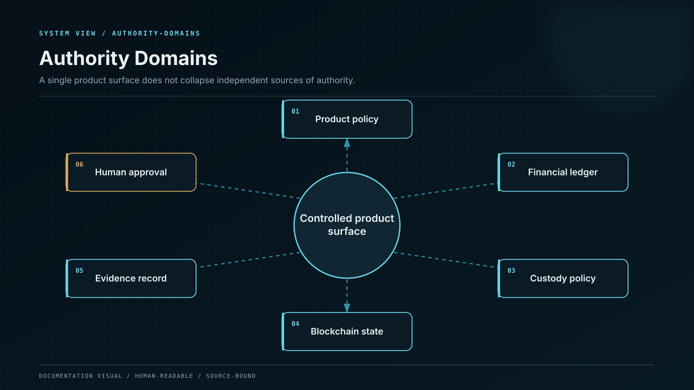

# Advanced Platform Architecture



Whale CeFi exposes one product surface while preserving six independent authority domains. The separation is deliberate: a compromise or defect in one domain cannot silently acquire the powers of another.


## Authority domains

| Domain       | Owns                                                                  | Cannot own                                                 |
| ------------ | --------------------------------------------------------------------- | ---------------------------------------------------------- |
| Experience   | User intent, presentation, accessibility, and review state            | Balances, policy approval, or signatures                   |
| Product      | Eligibility, terms, plan versions, limits, and disclosures            | Ledger journals or custody policy                          |
| Financial    | Accounts, liabilities, accruals, journals, and reconciliation         | Private keys or product copy                               |
| Custody      | Controlled wallets, transaction policy, signing quorum, and broadcast | Customer entitlement or reward calculation                 |
| On-chain     | Contract state, vault assets, position receipts, and emitted events   | Off-chain legal terms or undisclosed liabilities           |
| Intelligence | Evidence retrieval, reasoning, simulation, and unsigned preparation   | Final approval, asset authority, or source-of-truth status |

## The canonical transaction envelope

Every material workflow carries the same envelope from entry to final reconciliation:

```
operation_id
actor_id / subject_id
tenant_id
product_version_id
asset_id / network_id
intent_hash
idempotency_key
policy_snapshot_id
evidence_bundle_id
ledger_journal_id
custody_request_id
chain_transaction_id
created_at / effective_at / observed_at
correlation_id / causation_id
```

The fields are immutable once the operation crosses its acceptance boundary. A service may append a new observation or state transition, but it cannot rewrite the original intent, product version, policy snapshot, or journal.

## Sources of truth

There is no universal database called “the source of truth.” Authority is assigned per fact:

| Fact                | Authoritative record                  | Independent corroboration                  |
| ------------------- | ------------------------------------- | ------------------------------------------ |
| Accepted plan terms | Signed product-version snapshot       | User review receipt                        |
| Customer obligation | Double-entry ledger                   | Statement projection and reconciliation    |
| Controlled asset    | Custody inventory or contract balance | Chain observation and wallet-control proof |
| On-chain execution  | Finalized block and receipt           | Independent RPC providers and indexer      |
| Contract behavior   | Runtime bytecode and storage state    | Reproducible build and source verification |
| Rate in force       | Effective-dated rate registry         | Product snapshot bound to the position     |
| WENI market claim   | Pinned evidence bundle                | Source diversity and conflict checks       |

## State before narrative

All business flows are state machines. A natural-language message such as “withdrawal completed” is a rendering of a terminal state; it cannot create that state. The underlying transition is accepted only when its preconditions, authorization, financial journal, external evidence, and idempotency rule agree.

## Local failure containment

Failure is scoped to the smallest safe boundary. A stale price disables valuation-dependent decisions without disabling principal withdrawal. A degraded RPC provider stops new on-chain credit on the affected network without changing other networks. A reconciliation break freezes the affected asset cohort without rewriting balances. A WENI outage removes explanation and preparation features while the financial and custody planes remain intact.

## Completion rule

An operation is complete only when the business state, financial state, external settlement state, and evidence state agree. A successful HTTP response, a submitted chain transaction, or a signed custody request is an intermediate event — never the definition of completion.
