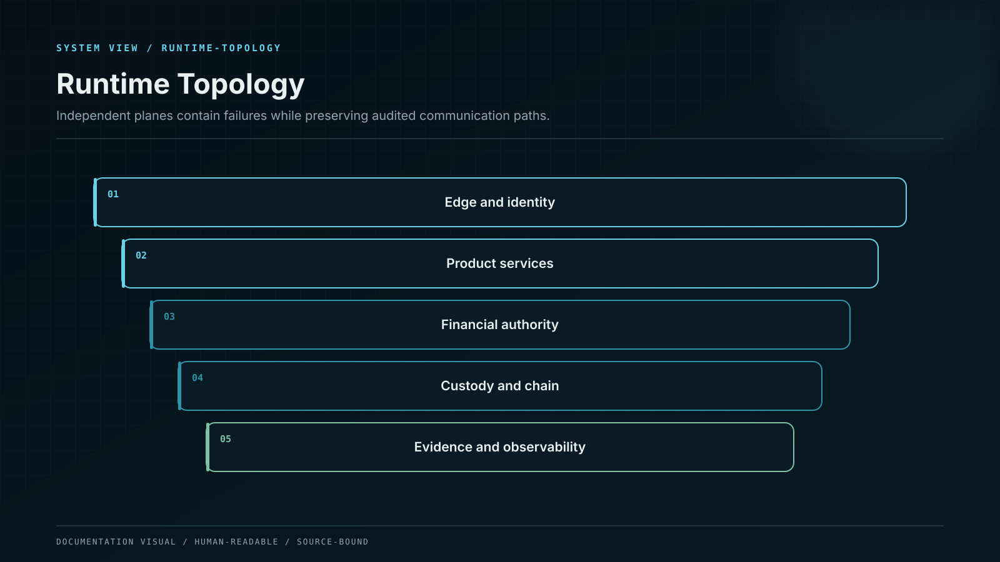

# Platform Scope and System Context

This chapter defines the operating platform beneath Whale CeFi: client surfaces, services, data stores, financial records, blockchain connectivity, custody, contracts, security and release operations. Internal AI-agent technology is explicitly outside scope.

## Control model

| Component or state   | Responsibility                                                         |
| -------------------- | ---------------------------------------------------------------------- |
| Client surfaces      | Web, mobile, administration and institutional product interfaces.      |
| Platform services    | Identity, portfolio, staking, rewards, ledger and transaction domains. |
| Data and event plane | Transactional, streaming, cache, time-series and analytical systems.   |
| Financial authority  | Ledger, settlement evidence, reconciliation and exception control.     |
| Custody/contracts    | MPC custody policy and on-chain smart-contract authority.              |
| SCOPE SEPARATION     | Model training, cognition and all AI-agent internals.                  |

## Invariants

* Treat platform infrastructure and AI-agent technology as separate controlled documents.
* Every component receives an owner, environment, authority class and evidence state.
* Financial state is governed independently from presentation and analytical projections.
* External providers are dependencies with explicit failure and continuity modes.
* Runtime evidence binds every architecture element to its deployed control.

## Failure containment

| Failure             | Effect                                            | Control                     | Response                   |
| ------------------- | ------------------------------------------------- | --------------------------- | -------------------------- |
| Scope bleed         | AI internals displace platform detail             | Explicit exclusion register | Isolate                    |
| Authority ambiguity | UI or analytics becomes source of record          | System-of-record matrix     | Reject and reconcile       |
| Hidden dependency   | Provider failure has no degraded mode             | Dependency inventory        | Enter degraded mode        |
| Status inflation    | An implementation lacks matching runtime evidence | Evidence tags               | Suppress unsupported state |

## Operational evidence

* Approved platform boundary and excluded AI-technology list.
* System context, ownership and authority diagrams.
* Environment and external-dependency inventory.
* Source-of-record matrix for every material state.
* Architecture-to-runtime evidence index.

## Boundary conditions

WENI internals are specified in the dedicated WENI section and remain outside platform-service authority.
