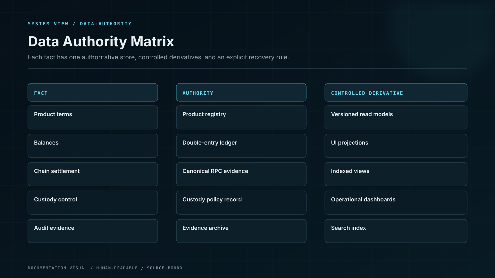

# Transactional and Time-Series Authority

PostgreSQL is the transactional source for financial and product records, with TimescaleDB for governed time-series workloads. Schema ownership, constraints, isolation, high availability, backup and recovery define the actual authority.

## Control model

| Component or state    | Responsibility                                           |
| --------------------- | -------------------------------------------------------- |
| Ledger schemas        | Accounts, journals, postings and reconciliation records. |
| Product schemas       | Positions, products, tasks and operational state.        |
| Timescale hypertables | Yield, market, service and audit time series.            |
| Read models           | Purpose-specific replicas or projections.                |
| Multi-AZ database     | Synchronous durability and automated failover.           |
| Backup/PITR           | Encrypted recovery points and tested restoration.        |

## Invariants

* Use constraints for balanced postings, uniqueness and valid state transitions.
* Assign schemas and migrations to one owning bounded context.
* Separate OLTP queries from heavy analytical workloads.
* Protect backup keys and test restoration into isolated accounts.
* Measure failover data loss and client reconnection, not only database availability.

## Failure containment

| Failure          | Effect                                | Control                      | Response     |
| ---------------- | ------------------------------------- | ---------------------------- | ------------ |
| Migration defect | Financial schema becomes inconsistent | Expand/contract and rollback | STOP         |
| Replica lag      | Read view shows stale balance         | Authority labels/lag gates   | READ PRIMARY |
| Failover split   | Clients write to inconsistent leader  | Managed fencing              | RECONNECT    |
| Backup illusion  | Restore fails during incident         | Regular restore drills       | ESCALATE     |

## Operational evidence

* Synchronous zonal durability, cross-region recovery replication, and controlled writer-failover evidence.
* Schema catalogue, ownership and migration policy.
* Constraint and transaction-isolation tests.
* Failover latency and client-recovery evidence.
* Backup, PITR and restore drill reports.

## Boundary conditions

A database marked Multi-AZ is not assumed to meet recovery objectives until failover and restoration are measured.
