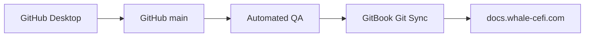

# Официальный выпуск Whale CeFi: GitHub → GitBook

Версия: 5.0.0  
Дата выпуска: 29 июля 2026  
Статус: официальный публичный релиз

## Архитектура публикации

GitHub `main` хранит канонический Markdown, историю и release controls.
GitBook синхронизирует этот source state и отображает официальную
читательскую версию на `docs.whale-cefi.com`.



## 1. Проверь аккаунты

1. Владелец GitHub использует двухфакторную аутентификацию.
2. Репозиторий принадлежит организации `Whale-CeFI`.
3. GitBook‑аккаунт имеет административный доступ к официальной организации
   Whale CeFi.
4. GitBook GitHub App получает доступ только к репозиторию
   `docs.whale-cefi.com`.
5. Пароли, recovery codes, токены, приватные ключи и seed phrases не
   передаются исполнителю и не попадают в репозиторий.

## 2. Загрузи релиз через GitHub Desktop

Официальный репозиторий:

`https://github.com/Whale-CeFI/docs.whale-cefi.com`

1. Войди в GitHub Desktop под аккаунтом с доступом к организации
   `Whale-CeFI`.
2. Выбери **File → Clone repository**.
3. Клонируй `Whale-CeFI/docs.whale-cefi.com` и оставь ветку `main`.
4. Выбери **Repository → Show in Explorer**.
5. Распакуй всё содержимое
   `Whale_CeFi_Official_Release_v5.0_GitHub_Desktop.zip` прямо в открытую
   корневую папку репозитория.
6. Не копируй в репозиторий сам ZIP и не создавай дополнительную родительскую
   папку.
7. Вернись в GitHub Desktop и проверь полный список изменений.
8. Используй commit message
   `docs: publish Whale CeFi official documentation v5.0`.
9. Нажми **Commit to main**, затем **Push origin**.

После push весь релиз появляется в GitHub одним контролируемым commit.

## 3. Проверь корень репозитория

После commit в корне находятся:

- `.gitbook.yaml`
- `README.md`
- `SUMMARY.md`
- `package.json`
- `RELEASE_NOTES.md`
- `assets/`
- `data/`
- `schemas/`
- `openapi/`
- `asyncapi/`
- `scripts/`
- `controlled-specifications/`

Если эти файлы находятся внутри дополнительной родительской папки, структура
загружена неверно. GitBook подключается к уровню, на котором лежит
`.gitbook.yaml`.

## 4. Подтверди GitHub Actions

Открой **Actions → Validate documentation**.

Release gate считается пройденным при результате:

- 224 reader routes;
- 72 controlled specifications;
- 288 failure-mode controls;
- 360 release-evidence records;
- 0 errors;
- 0 warnings.

Отчёт релиза: `release/qa-v5.0-report.json`.  
Контроль целостности: `release/SHA256SUMS`.

## 5. Включи GitBook Git Sync

1. В GitBook открой основной section официального Docs Site.
2. Нажми **Set up** рядом с **Git Sync**.
3. Выбери **GitHub**.
4. Выбери репозиторий `Whale-CeFI/docs.whale-cefi.com`.
5. Branch: `main`.
6. Project directory: `/`.
7. Направление первого импорта: **GitHub → GitBook**.
8. Подтверди синхронизацию.

GitBook использует корневую конфигурацию:

```yaml
root: ./

structure:
  readme: README.md
  summary: SUMMARY.md
```

Landing page и навигация управляются из GitHub. Ручное создание второго
`README` или отдельного меню в GitBook нарушает каноническую структуру.

## 6. Настрой официальный GitBook Site

| Настройка | Значение |
|---|---|
| Site title | `Whale CeFi Documentation` |
| Short title | `WHALE Docs` |
| Description | `Official product, risk, security, evidence, legal, and technical documentation for Whale CeFi.` |
| Product link | `https://whale-cefi.com` |
| Canonical docs origin | `https://docs.whale-cefi.com` |
| Header background | `#062739` |
| Deep background | `#030E16` |
| Surface | `#094E68` |
| Primary accent | `#7BC9E8` |
| Secondary text | `#424E56` |

Основной customer-facing контрагент и оператор в site copy: **Pulpo Fintech, S.A. de C.V. (PSAD-0023), El Salvador**.

## 7. Проведи production QA

Проверь минимум эти страницы:

1. Whale CeFi Documentation
2. Start Here
3. Current Rate Card
4. Your First Deposit
5. Rates and Reward Mathematics
6. WENI — Native Intelligence
7. The Iron Boundary
8. Proof of Reserves and Liabilities
9. Smart-Contract Architecture and Deployment Identity
10. Release Scope and Acceptance
11. Evidence Center
12. Entity and Service Register

Для каждой страницы:

- заголовок совпадает с навигацией;
- direct answer отображается в начале;
- таблицы и hints читаются;
- изображения открываются;
- внутренние ссылки работают;
- mobile layout не обрезает таблицы и код;
- текущий бренд — Whale CeFi;
- customer contracting and operating entity — Pulpo Fintech, S.A. de C.V. (PSAD-0023);
- отсутствуют старое имя stewardship entity, legacy‑домены,
  предрелизные статусы и обещания отдельного позднего выпуска.

## 8. Подключи домен

В **Site settings → Custom domain** укажи:

`docs.whale-cefi.com`

В DNS создай запись с точными значениями `Name` и `Target`, которые показывает
GitBook. После активации проверь:

- HTTPS;
- canonical URL;
- корневую страницу;
- sitemap;
- `llms.txt`;
- мобильное отображение;
- отсутствие redirect loop.

## 9. Защити `main`

Открой **Repository → Settings → Rules → Rulesets** и создай ruleset
`Protect canonical documentation`.

Включи:

- block force pushes;
- restrict deletions;
- require pull request;
- require conversation resolution;
- require linear history;
- require status check `Validate documentation`.

GitBook GitHub App получает bypass только для операций, необходимых Git Sync.

## 10. Выпускай изменения через один контролируемый цикл

1. Создай branch `docs/<short-change>`.
2. Сначала обнови canonical data record.
3. Обнови зависимые страницы.
4. Запусти `npm run build:indexes`.
5. Запусти `npm run check`.
6. Открой pull request.
7. Проверь GitHub Actions и GitBook PR preview.
8. Получи требуемый Product, Legal, Finance, Security или Engineering review.
9. Merge в `main`.
10. Подтверди GitBook sync.

Generated files не редактируются вручную:

- `search-index.json`
- `source-manifest.json`
- `content-index.json`
- `seo/routes.json`
- `sitemap.xml`
- `llms.txt`
- `llms-full.txt`

Они всегда создаются командой `npm run build:indexes`.

## Release identity

- Release ID: `WHALE-CEFI-DOCS-V5.1`
- Version: `5.1.0`
- Effective date: `2026-08-10`
- Git tag: `docs-v5.1.0`
- Canonical branch: `main`
- Canonical docs origin: `https://docs.whale-cefi.com`
- Customer contracting and operating entity: `Pulpo Fintech, S.A. de C.V. (PSAD-0023)`
