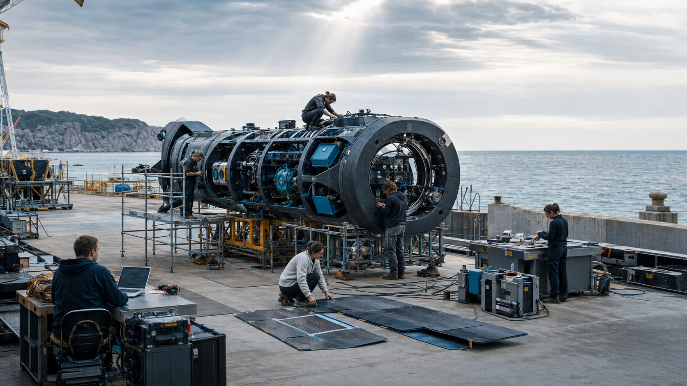

# Controlled Technical Specifications

This section preserves the full engineering depth behind the reader-facing documentation. It is organised as two controlled papers:

* [Platform Infrastructure and Financial Core](platform-infrastructure-and-financial-core/)
* [WENI Model and System Architecture](weni-model-and-system-architecture/)

Each chapter follows the same five-part contract: core specification, reference architecture, runtime responsibility, failure-mode analysis, and acceptance evidence. The structure makes a requirement inspectable without forcing a first-time user to navigate the complete engineering catalogue.

