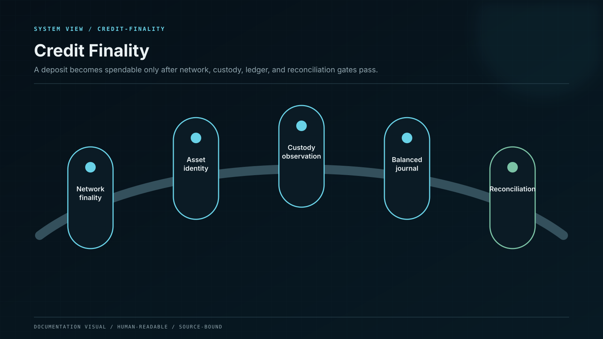
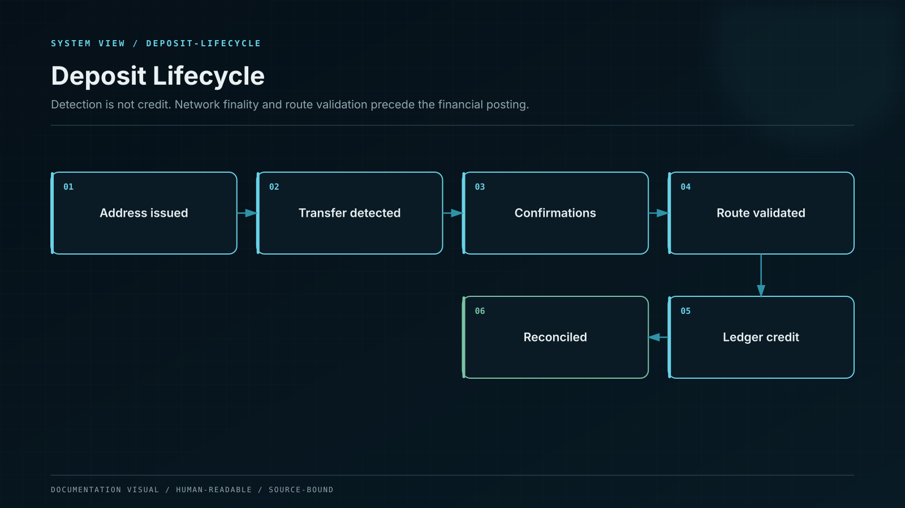

# Deposits and Credit Finality

What to check before sending an asset, how confirmation works and when a balance becomes available.

### Before you send anything

* Copy the deposit address from your own authenticated Whale CeFi account.
* Confirm the asset symbol and the network name separately.
* If the asset requires a memo, tag or destination identifier, include it exactly.
* Send a small test amount when the route is unfamiliar.
* Never use an address received through a private message or search advertisement.

### After you send

Your deposit moves through visible states:

1. **Address issued** — the destination belongs to the correct account and route.
2. **Transaction detected** — the network has seen the transfer.
3. **Confirming** — the system waits for the network-specific finality rule.
4. **Credited** — the internal ledger records the available asset balance.
5. **Reconciled** — the credited balance agrees with custody and blockchain evidence.

The transaction identifier, network, amount, address and confirmation count remain available in the deposit record.

> If you selected the wrong network, stop. Do not send a second transaction to “fix” the first. Open the original record and contact support from the official documentation link.

## Posting rule

A blockchain observation is not sufficient for financial credit. The deposit service normalises the asset and network, validates the destination, binds the event to a canonical transaction identifier, applies the chain-specific confirmation rule, and posts one idempotent ledger journal. Reprocessing the same event cannot create a second credit.

## Exception handling

Unknown assets, wrong-network transfers, missing memo values, chain reorganisations, provider disagreement and amount mismatches enter an exception queue. Operators may resolve evidence and post a corrective journal; they do not directly overwrite a user balance.
