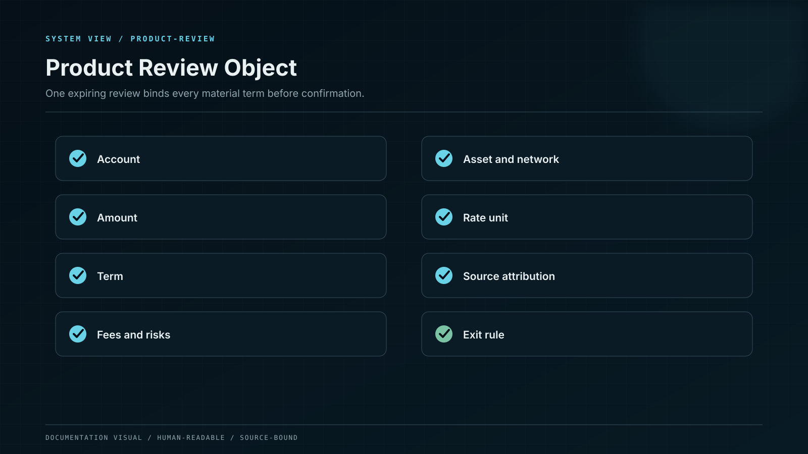

# Product Model

The product boundary between account experience, financial obligation, custody and external networks.

Whale CeFi provides one product surface for supported crypto earning and staking plans. It coordinates account access, deposit credit, plan opening, daily reward accounting, maturity and withdrawal.

The product is centralised at the account and operating layer: Whale CeFi runs the interface, applies eligibility rules, maintains the internal financial record and coordinates custody and transactions. External blockchains and integrated protocols remain separate systems with their own rules and risks.

### What the platform controls

* account, authentication and eligibility policy;
* plan catalogue, terms and disclosure versions;
* internal ledger, statements and reward postings;
* transaction workflow, limits and approvals;
* customer support, incidents and change communication.

### What the platform cannot control

* the market price of an asset;
* finality or congestion of a public network;
* unaffiliated protocol governance;
* faults in third-party infrastructure;
* reward conditions outside the accepted fixed product promise.

## System boundary

The platform separates presentation, product policy, financial authority, custody authority and external settlement. Each material action crosses these boundaries through authenticated, versioned and auditable contracts.

The internal ledger represents the platform's obligation to users. Custody and blockchain data provide settlement evidence; they do not replace user-level accounting. Reconciliation connects both sides and stops affected operations when the difference exceeds the asset- and network-specific tolerance.
