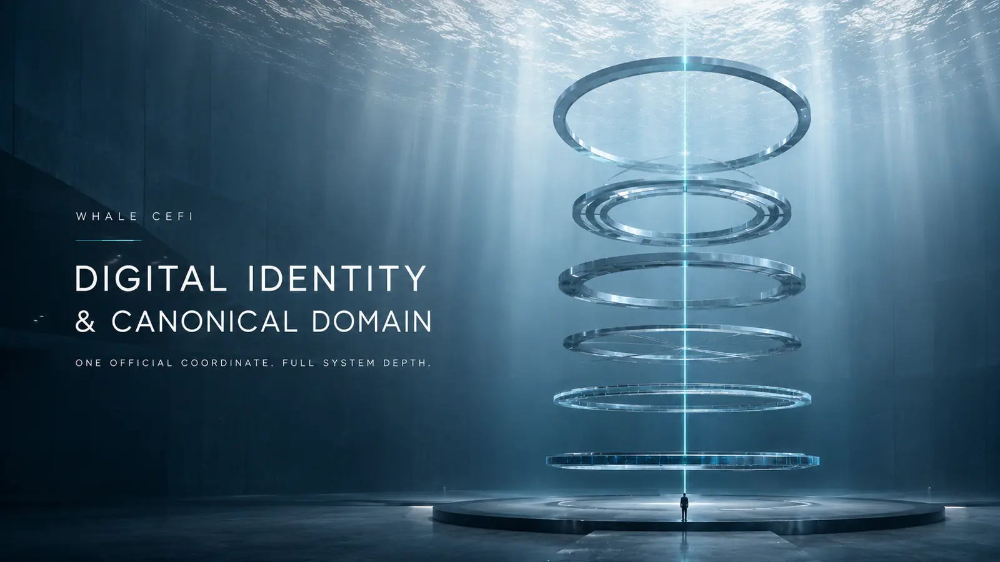
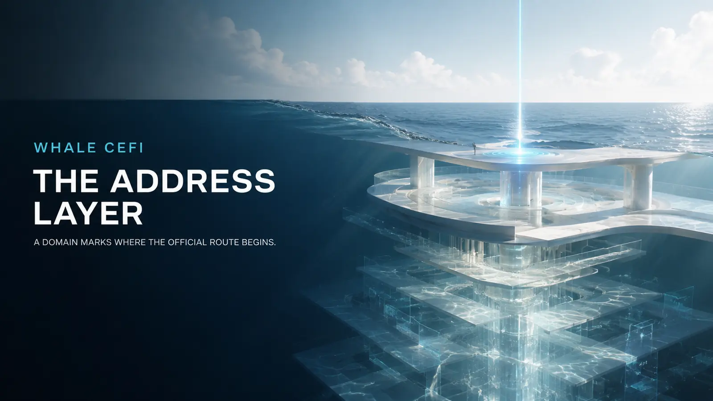
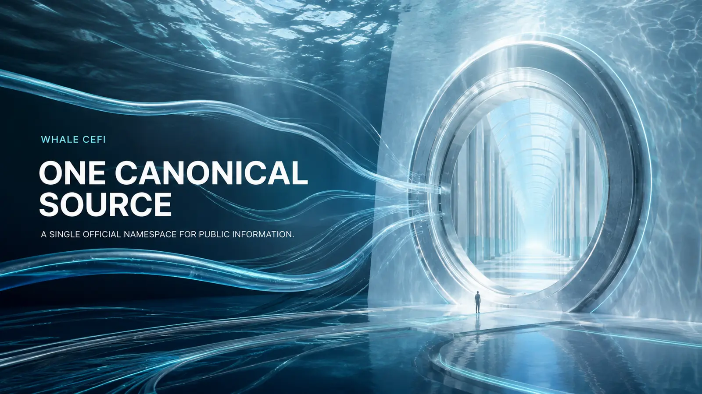
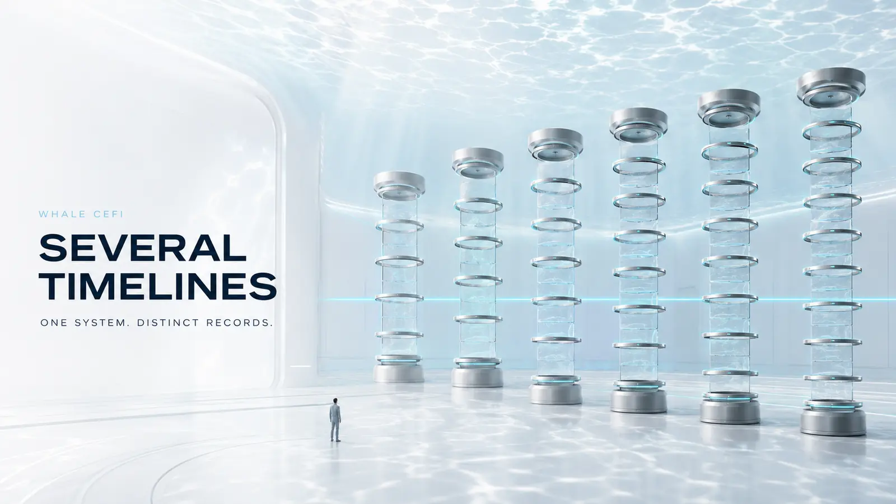
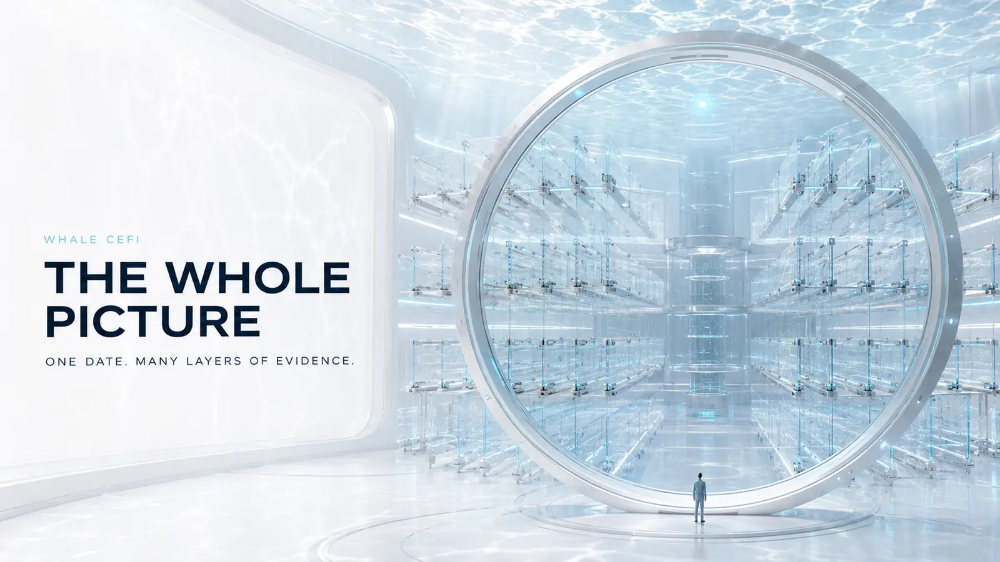
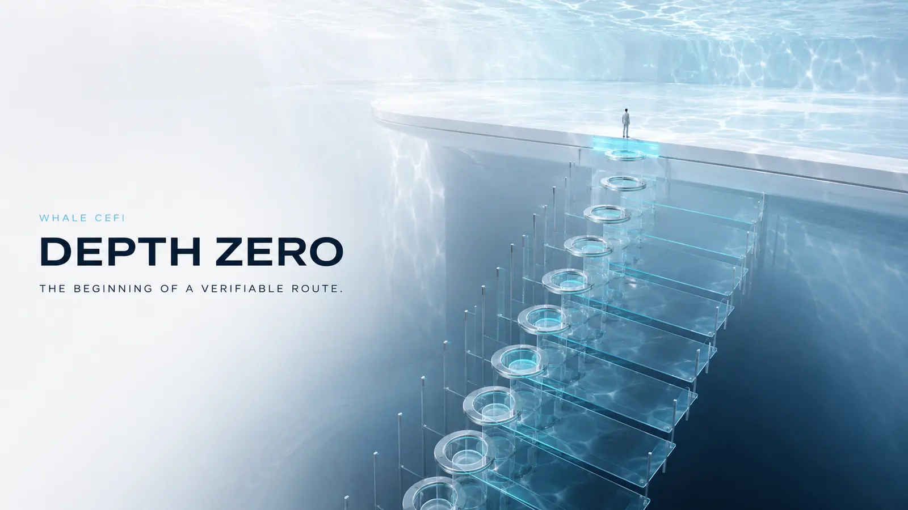
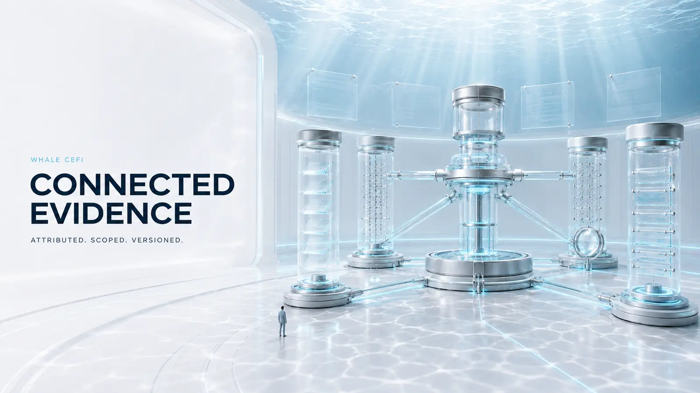
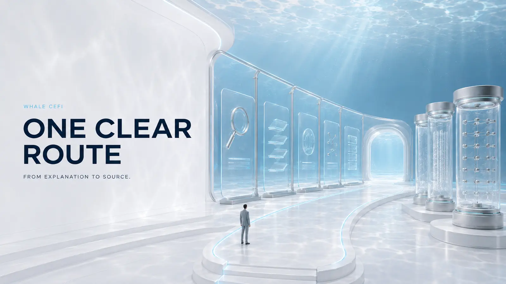

# Digital Identity and Canonical Domain



## Why a domain registration date is the age of an address—not the age or quality of an entire system

- **Canonical domain:** [whale-cefi.com](https://whale-cefi.com)
- **Registration recorded:** 23 July 2026
- **Registry source:** [Verisign RDAP record](https://rdap.verisign.com/com/v1/domain/whale-cefi.com)
- **Last reviewed:** 17 August 2026

> **The domain tells you where the official journey begins.**
>
> **The documentation explains how the system is structured.**
>
> **The evidence shows what each material statement rests on.**

`whale-cefi.com` is the canonical domain of Whale CeFi's current digital identity. It provides one official point of entry for the product environment, documentation, Trust Center, legal materials, technical resources, change records, and official communication channels.

The domain was registered on 23 July 2026. That date records when this specific internet address was created. It is not a universal date for the legal, financial, operational, or technical components organised within the Whale CeFi system.

Each of those components has its own timeline, version, scope, owner, and source of evidence.

## A domain is an address layer



A domain name performs a precise and important function: it provides a human-readable address through which users can reach an official digital environment.

Technically, the domain belongs to the naming and routing layer of the internet. It helps answer:

> Where does the official Whale CeFi information begin?

It does not, by itself, answer:

- which legal terms apply to a particular product;
- which entity performs a particular role;
- how assets and obligations are recorded;
- which software version is deployed;
- which smart-contract addresses are current;
- what an audit examined;
- or which document version is in force.

Those questions require their own primary records.

Reading the date of a domain as the date of every system behind it would conflate the address with the organisation, controls, records, and technology available through that address. It would be comparable to treating the date on an office sign as the date of every agreement, ledger, control, and system used inside the organisation.

The date is valid within its proper scope: it is the registration date of the current canonical domain.

## Why whale-cefi.com was established



Whale CeFi required a dedicated, brand-aligned domain capable of supporting a unified public information architecture.

The purpose of `whale-cefi.com` is to bring the current Whale CeFi environment into one coherent namespace, including:

- the product interface;
- the documentation hierarchy;
- the Trust Center;
- applicable legal materials;
- technical and developer resources;
- official communication routes;
- release and change records;
- English- and Russian-language documentation;
- and AI-assisted navigation across the approved knowledge base.

This structure gives every material page a clear origin and allows users to move from a plain-language explanation to the corresponding source, version, and evidence without reconstructing the relationship between separate locations.

The result is a simple public model:

```text
Whale CeFi
    ↓
whale-cefi.com
    ↓
Current documentation
    ↓
Applicable version and scope
    ↓
Primary source or supporting evidence
```

## What “canonical” means

A canonical domain is the preferred source of current public information for a digital system.

For Whale CeFi, this means that:

- the primary environment resolves under `whale-cefi.com`;
- current documentation belongs to the same official digital boundary;
- material pages point to the applicable source records;
- the official repository identifies the canonical domain;
- the canonical domain identifies the official repository;
- each material page has one preferred public URL;
- superseded material is distinguished from the current version;
- and significant changes can be recorded through a consistent change history.

Canonicalisation is also important for discovery. Where similar or duplicate versions of a page exist, a canonical URL helps search engines identify the preferred version and consolidate signals around it. This is the role described in [Google Search Central's canonical URL guidance](https://developers.google.com/search/docs/crawling-indexing/consolidate-duplicate-urls).

## One system, several timelines



A mature documentation model does not force unrelated events into a single date. It preserves the correct clock for each category of information.

| Timeline | What it records | Appropriate source |
|---|---|---|
| Domain timeline | Registration and administration of the internet address | Registry RDAP record |
| Legal timeline | Entity records, agreements, effective dates, and role definitions | Applicable legal documents and official registers |
| Engineering timeline | Research, architecture, implementation, and testing | Specifications, repositories, and engineering records |
| Deployment timeline | Release, environment, network, address, build, and configuration | Release and deployment records |
| Review timeline | Scope and date of an audit, assessment, or other review | The issued report and its referenced artefacts |
| Documentation timeline | Publication, revision, approval, and supersession | Version metadata and change history |
| Operational timeline | Current service state and material changes | Status and operational records |

These timelines may be connected, but they are not interchangeable.

The registration date of `whale-cefi.com` belongs to the domain timeline. A legal document, technical release, deployment, or review must be evaluated against its own date and source.

## Why the easiest date is not the whole picture



Domain registration data is straightforward to retrieve. By contrast, understanding a financial and technical system requires several categories of information to be read together.

Ease of access does not determine the material importance of a data point. Its importance depends on the question being asked.

| Question | Evidence that answers it |
|---|---|
| Where is the official source of current information? | Canonical domain and Official Channels Register |
| When was the current domain registered? | Authoritative RDAP record |
| Which entity performs a defined role? | Applicable terms and official entity records |
| How are assets and obligations recorded? | Financial records, ledger model, and reconciliation materials |
| Which product terms apply? | Current product schedule and applicable legal terms |
| Which software version is current? | Release manifest and version register |
| Which code is deployed? | Build and deployment records |
| Which contracts are current? | Smart-Contract Registry |
| What was reviewed? | Report scope, version, commit, network, and address mapping |
| Which authorities exist in the system? | Authority and role matrix |
| What changed between versions? | Change Log and supersession record |

The domain is therefore an essential navigation record. The underlying legal, financial, technical, and operational questions are answered by the records designed for those subjects.

## DEPTH ZERO: the beginning of a verifiable route



Within Whale CeFi, `DEPTH ZERO` represents the point at which a user begins with understanding.

At this point, a reader should be able to establish:

- where the official environment begins;
- which documentation is current;
- which version applies;
- what the page covers;
- who owns the information;
- when it was last reviewed;
- and where the corresponding primary source can be found.

The canonical domain supplies the first coordinate. The documentation then allows the reader to choose the appropriate depth:

```text
Depth 1 — Plain-language explanation
Depth 2 — Product terms and operating model
Depth 3 — Legal roles and responsibilities
Depth 4 — Financial architecture and records
Depth 5 — Technical registries and deployments
Depth 6 — Versioned artefacts and primary evidence
```

A reader does not need to understand every technical layer before using the documentation. The purpose of the structure is to make each deeper layer available when required.

## What carries substantive weight in a CeFi system


The quality of a CeFi system is determined by the substance of its controls and records—not by asking one internet-layer date to represent the entire platform.

### Legal clarity

The documentation should identify:

- the entity performing each relevant role;
- the terms that apply to a product;
- the boundaries between different responsibilities;
- the effective version of each agreement;
- and the source through which the relevant record can be verified.

### Asset and record controls

The financial documentation should explain, within the approved disclosure scope:

- how assets are recorded;
- how obligations are recorded;
- how financial events enter the ledger;
- how reconciliation is performed;
- how exceptions are handled;
- and how movement instructions are authorised and recorded.

### Product and withdrawal lifecycle

The applicable documentation should identify:

- the relevant product and asset;
- the applicable term and rate methodology;
- the lifecycle of a request;
- network and finality conditions;
- fees and other applicable conditions;
- and the record through which completion is established.

### Technical reproducibility

For technical components, meaningful identity may include:

- repository and commit;
- build and checksum;
- environment and release;
- network and chain identifier;
- deployment address and block number;
- implementation and proxy relationship;
- and administrative roles or other defined authorities.

### Review scope

A review or audit should be read against the exact object it examined. Relevant fields may include:

- component;
- repository;
- commit;
- build;
- network;
- address;
- review period;
- findings;
- and subsequent verification records.

### Change assurance

Material changes should be connected to:

- a version;
- an accountable owner;
- an approval record;
- the affected scope;
- the publication date;
- and a corresponding Change Log entry.

These are the records that explain how the system is structured and what is current. The domain provides the official environment in which they can be organised and discovered.

## The domain connects evidence; it does not replace it



The purpose of `whale-cefi.com` is not to make every material statement true merely because it appears under an official address.

Its role is to provide a controlled environment in which material statements can be:

- attributed;
- scoped;
- versioned;
- linked to source material;
- reviewed;
- updated;
- and, when necessary, superseded without ambiguity.

For a material statement, the intended provenance path is:

```text
Public statement
    ↓
Defined scope
    ↓
Current status
    ↓
Accountable owner
    ↓
Primary source or approved artefact
    ↓
Version or observation date
    ↓
Limitations and next review
```

This converts the website from a collection of pages into an organised record of what Whale CeFi publishes, what each statement covers, and where its basis can be examined.

## The role of GitHub


The canonical domain and the official GitHub repository serve different but complementary purposes.

`whale-cefi.com` presents the current documentation in an accessible form. GitHub can preserve the technical publication history through:

- commits;
- authorship records;
- timestamps;
- diffs between versions;
- releases;
- checksums;
- and superseded files.

The strongest publication chain is bidirectional:

```text
whale-cefi.com
    ↕
Official repository
    ↕
Release
    ↕
Commit
    ↕
Checksum
    ↕
Published version
```

This allows a reader to identify the origin of a published page and distinguish the current version from earlier material.

## What the user gains



The unified domain model gives users:

- one official address to remember;
- one current documentation hierarchy;
- consistent terminology;
- a clear route from summary to source;
- direct access to applicable versions;
- visible review and update dates;
- a structured change history;
- and a single knowledge base through which documentation search and AI-assisted navigation can operate.

As the platform grows, new products, languages, registries, and technical resources can be added without changing the principal coordinate through which the system is understood.

## In one paragraph

`whale-cefi.com` was registered on 23 July 2026 as the canonical domain of Whale CeFi's current digital identity. The date records the creation of this specific internet address; it is not a single creation date for every legal, financial, operational, or technical component organised within the platform. Each component has its own version, timeline, scope, owner, and source of evidence. The purpose of the domain is to unite the product environment, documentation, Trust Center, legal materials, technical resources, official channels, and change history within one coherent and verifiable namespace. The domain establishes where the official route begins; the documentation and its linked evidence establish what the system contains and what each material statement rests on.

## Final perspective

At the surface, there is one coordinate.

Beneath it, there is a structured system of documents, roles, records, releases, and evidence.

The registration date identifies when the current official coordinate was created. It should be read precisely within that scope. The wider Whale CeFi system is understood through the complete provenance of its individual components.

> **One official coordinate.**
>
> **One current documentation system.**
>
> **A distinct source and timeline for every material component.**

## Frequently asked question

### Why was whale-cefi.com registered on 23 July 2026?

`whale-cefi.com` was registered on 23 July 2026 as the canonical domain of Whale CeFi's current digital identity. It brings the product environment, documentation, Trust Center, legal materials, technical resources, official channels, and change history into one coherent namespace.

The registration date applies to the current internet address. Legal documents, engineering work, reviews, releases, deployments, and other system components have their own dates and supporting sources. The domain defines the official point of entry; the documentation and linked evidence describe the complete system behind it.

## Reference points

- [Current registration data for whale-cefi.com — Verisign RDAP](https://rdap.verisign.com/com/v1/domain/whale-cefi.com)
- [Registration Data Access Protocol overview — ICANN](https://www.icann.org/rdap)
- [Canonical URL guidance — Google Search Central](https://developers.google.com/search/docs/crawling-indexing/consolidate-duplicate-urls)
