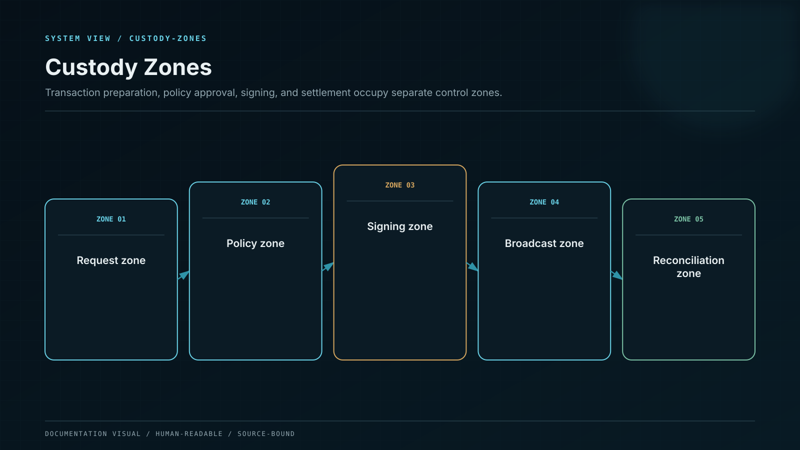

# Security and Custody

Segregated vaults, policy-bound signing, and reconciliation without conflating custody with customer entitlement.

Custody controls private-key authority and external asset movement. The financial ledger controls what Whale CeFi owes. Neither system can replace the other.

## Vault taxonomy

| Vault class        | Purpose                                   | Default movement rule                                  |
| ------------------ | ----------------------------------------- | ------------------------------------------------------ |
| Deposit collection | Receive user deposits before sweep        | Inbound plus governed sweep only                       |
| Operating hot      | Bounded routine withdrawals               | Low balance, velocity and destination limits           |
| Warm settlement    | Refill hot and receive strategy returns   | Multi-approver, scheduled windows                      |
| Cold reserve       | Long-horizon reserve and recovery         | Highest quorum, delayed, offline approval              |
| Strategy           | Explicit protocol or validator allocation | Allowlisted contract and capped exposure               |
| Fee and treasury   | Platform-owned assets                     | Physically and logically separate from customer assets |

Customer principal, reward inventory, platform capital, and fees never share an undifferentiated vault balance without sub-ledger segregation and independent reconciliation.

## Transaction lifecycle

1. A financial or operational service creates a typed transaction request.
2. Policy validates asset, source vault, destination, amount, velocity, purpose, user claim, and risk state.
3. Independent approvers review the decoded payload and evidence.
4. The signing system signs only the exact approved payload.
5. Broadcast and replacement transactions preserve the original request identity.
6. Independent chain observers determine finality.
7. Reconciliation settles the pending ledger state.

## Authority separation

Policy administrators cannot approve their own policy change. Transaction initiators cannot satisfy approval quorum. Reconciliation operators cannot sign transactions. API credentials cannot change quorum or key membership. Emergency pausing cannot create a new destination.

## Key controls

Key shares are generated and held in isolated hardware-backed environments. No application service, WENI component, CI runner, or database can export signing material. Signer membership, device trust, recovery material, and quorum changes require independent approval and produce immutable evidence.

## Reconciliation

Custody balances and transaction states are reconciled against the ledger and independent blockchain observations continuously. An unexplained difference blocks new exposure and non-essential movement for the affected asset while preserving investigation and safe-exit paths.
