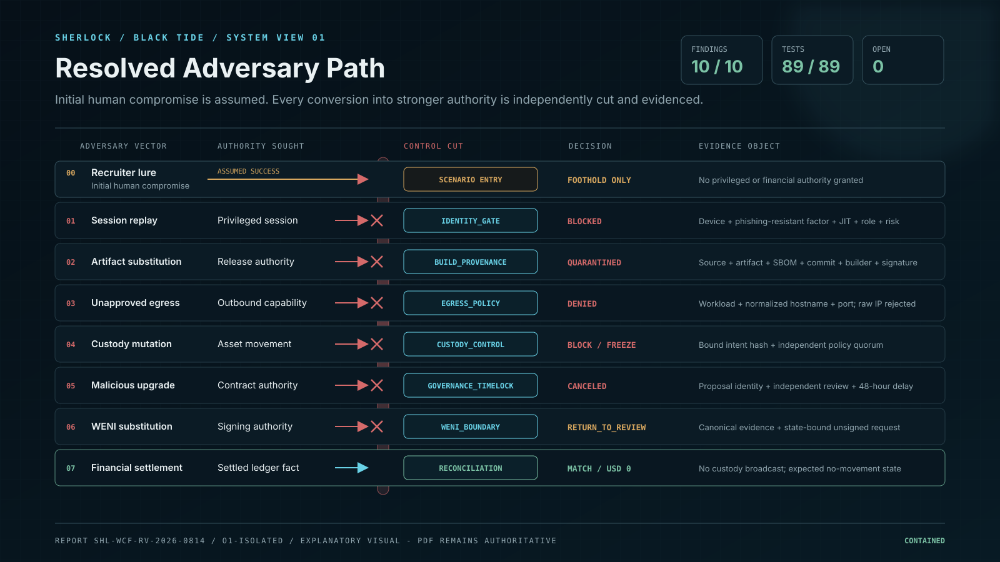
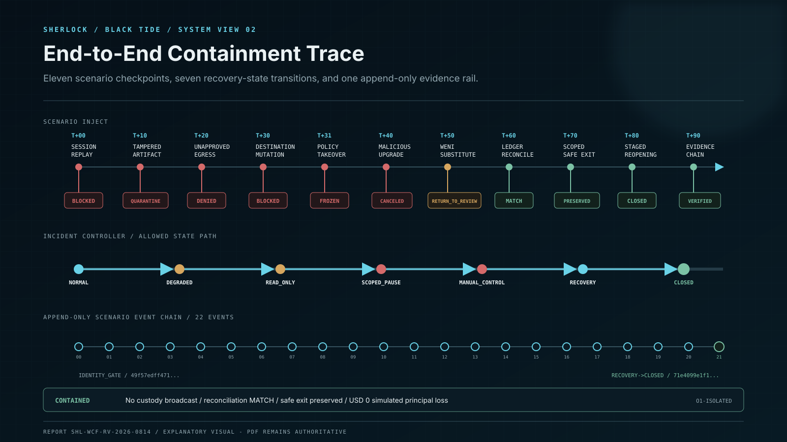
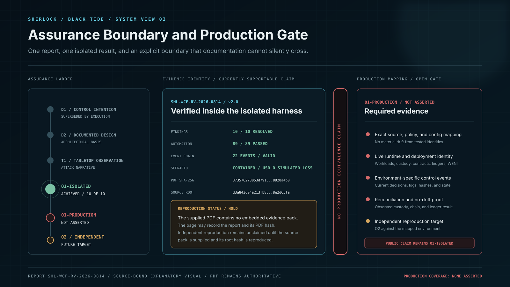

# Operation BLACK TIDE - Isolated Remediation Verification

Operation BLACK TIDE is an isolated adversary-emulation and remediation-revalidation exercise. It is not a production incident, does not evidence real-world attacker access to Whale CeFi, and does not claim that the tested code, policy, or configuration is deployed unchanged in production.


**Assurance boundary:** The report establishes `O1-ISOLATED` assurance for the defined revalidation harness. `O1-PRODUCTION` is explicitly not asserted. Production equivalence requires environment-specific mapping and evidence.


## Direct result

Within the defined isolated scope, SHERLOCK records all ten baseline findings as resolved and retested. The complete automated suite records 89 passes from 89 tests, a valid 22-event append-only hash chain, a contained end-to-end scenario, no custody broadcast, and USD 0 simulated principal loss.

| Measure | Recorded result |
|---|---:|
| Findings resolved | 10 / 10 |
| Open findings | 0 |
| Automated tests | 89 / 89 passed |
| Failed tests | 0 |
| Scenario outcome | CONTAINED |
| Simulated principal loss | USD 0 |
| Scenario evidence chain | 22 events / VALID |
| Assurance grade | O1-ISOLATED |
| Production deployment coverage | None asserted |

## Report and artifact identity



[Download the original 57-page PDF](https://github.com/Whale-CeFI/docs.whale-cefi.com/blob/main/.gitbook/assets/audits/SHERLOCK_Whale_CeFi_Operation_BLACK_TIDE_Remediation_Verification_v2.0_2026-08-14.pdf)

| Field | Value |
|---|---|
| Report ID | `SHL-WCF-RV-2026-0814` |
| Version | 2.0 |
| Issued | 14 August 2026 |
| Issuer | SHERLOCK Internal Security Assurance |
| Provider relationship | First-party / internal assurance |
| Baseline | `SHL-WCF-AE-2026-0814 v1.0` |
| Revalidation environment | `ISOLATED_REVALIDATION` |
| Assurance grade | `O1-ISOLATED` |
| PDF pages | 57 |
| PDF SHA-256 | `373576273053d791d45fa2628437c7b593e1ab993aa6b17e078321438920a4b0` |
| Reported source-root SHA-256 | `d3a843604a213fb8aed9062c4a0193c819401985390a64ac72f4a3a78e2d65fa` |


**Artifact availability:** The PDF supplied for this public release contains no embedded files. The executable evidence pack described by the report has not been supplied alongside the PDF. This page therefore records the report and its verified PDF hash, but does not independently claim reproduction of the 89-test run. If the source pack is published later, its archive hash and reproduction result must be added as a separate evidence record.


## Adversary view: attempted authority conversion

The exercise assumes that the initial human lure succeeds. It then tests whether that foothold can be converted into privileged identity, release authority, outbound network access, custody authority, contract authority, WENI-assisted transaction authority, or a settled financial fact.

| Attempted conversion | Injected action | Control decision | Evidence produced |
|---|---|---|---|
| Human foothold -> privileged session | Developer session replay | BLOCKED | Device, phishing-resistant factor, JIT grant, explicit role, revocation, and session-risk decision |
| Session -> release authority | Tampered artifact admission | QUARANTINED | Source, artifact, SBOM, commit, builder, environment, issue time, and signature binding |
| Runtime -> outbound capability | Unapproved egress | DENIED | Workload-bound normalized hostname and port decision; raw IP rejected |
| Operational access -> custody movement | Destination, amount, chain, fee, expiry, role, or policy mutation | BLOCKED / FROZEN | Immutable withdrawal intent fingerprint and independent policy quorum |
| Proposal -> contract authority | Malicious upgrade proposal | CANCELED / DENIED | Proposal identity, target scope, independent review, 48-hour delay, and cancellation |
| Hostile evidence -> WENI action authority | Address or state substitution | RETURNED_TO_REVIEW | Canonical evidence selection, state-bound unsigned request, and Iron Boundary event |
| Attempted movement -> settled ledger fact | Reconciliation after no broadcast | MATCH | Double-entry journal and direct no-movement comparison |

The exercise does not depend on one perimeter control. Each conversion into a stronger authority domain is independently interrupted and emits evidence.

## End-to-end containment trace

| Relative time | Inject | Decision |
|---|---|---|
| T+00 | Developer session replay | BLOCKED |
| T+10 | Tampered artifact admission | QUARANTINED |
| T+20 | Unapproved egress | DENIED |
| T+30 | Withdrawal destination mutation | BLOCKED |
| T+31 | Custody policy takeover | FROZEN |
| T+40 | Malicious upgrade proposal | CANCELED |
| T+50 | WENI address substitution | RETURNED_TO_REVIEW |
| T+60 | Ledger reconciliation | MATCH |
| T+70 | Scoped response and safe exit | PRESERVED |
| T+80 | Staged reopening | CLOSED |
| T+90 | Evidence-chain validation | VERIFIED |

No custody broadcast is created in the defined scenario. Reconciliation therefore confirms the expected no-movement state before the incident controller proceeds through scoped containment, manual control, recovery, and closure.

## Controls and fail-safe states

| Component | Narrow authority | Fail-safe state | Primary evidence object |
|---|---|---|---|
| `IdentityGate` | Privileged authorization | DENY | Identity decision event |
| `BuildProvenance` | Artifact admission | QUARANTINE | Signed statement and digest set |
| `EgressPolicy` | Outbound network capability | DENY | Host, port, and workload decision |
| `CustodyControl` | Review and execute withdrawal intent | BLOCK / FREEZE | Bound intent hash |
| `GovernanceTimelock` | Privileged contract change | DENY / CANCELED | Proposal identity and delay |
| `DoubleEntryLedger` | Financial posting and reconciliation | REJECT / FREEZE_SCOPE | Journal and comparison |
| `WeniBoundary` | Evidence and request preparation | RETURN_TO_REVIEW | State-bound unsigned request |
| `AuditLog` | Forensic ordering and integrity | INVALID_CHAIN | Previous hash and event hash |
| `IncidentController` | Containment and reopening | MANUAL_CONTROL | State-transition event |

## Findings closure register

| Finding | Closure | Retest | Assurance | Implemented control |
|---|---|---|---|---|
| SHL-01 | RESOLVED | PASSED | O1-ISOLATED | Evidence index and source/test/SBOM/provenance hash binding |
| SHL-02 | RESOLVED | PASSED | O1-ISOLATED | Privileged identity and replay-resistant session gate |
| SHL-03 | RESOLVED | PASSED | O1-ISOLATED | Release provenance and admission quarantine |
| SHL-04 | RESOLVED | PASSED | O1-ISOLATED | Immutable custody intent and separated policy authority |
| SHL-05 | RESOLVED | PASSED | O1-ISOLATED | Proposal identity, independent review, 48-hour timelock, and cancellation |
| SHL-06 | RESOLVED | PASSED | O1-ISOLATED | Workload-bound egress conformance |
| SHL-07 | RESOLVED | PASSED | O1-ISOLATED | Append-only forensic event chain |
| SHL-08 | RESOLVED | PASSED | O1-ISOLATED | Scoped circuit breaker, safe exit, and staged reopening |
| SHL-09 | RESOLVED | PASSED | O1-ISOLATED | WENI hostile-content rejection, state binding, and Iron Boundary |
| SHL-10 | RESOLVED | PASSED | O1-ISOLATED | Explicit exercise language and denial of production equivalence |

## WENI and the Iron Boundary

The WENI segment tests whether hostile or untrusted content can displace canonical evidence, alter a reviewed request, or obtain signing authority. The recorded closure requires all three boundaries to hold:

1. Untrusted content cannot become canonical evidence merely by issuing an instruction.
2. Any material change to destination, amount, chain, fee, expiry, or other bound state returns the request to review.
3. WENI can prepare an unsigned request but cannot sign it.

The report records `RETURN_TO_REVIEW` for state substitution and separately tests that WENI cannot sign.

## Evidence integrity

The report records 22 scenario events linked through `previous_hash` and `event_hash`. Tampering or reordering invalidates the chain. It also records a source manifest covering 43 files, 2,881 text lines, 18 Python modules, 14 JSON policy/evidence/schema files, three Solidity reference controls, and four Mermaid diagrams, with zero external Python dependencies.

These inventory values are report-recorded values. Until the referenced source pack is supplied and its source-root hash is reproduced, this documentation does not upgrade them into an independently reproduced result.

## Assurance boundary and next gate

### What this report supports

- The ten listed findings are recorded as resolved and retested inside the named isolated harness.
- The report records deterministic automated results, explicit fail-safe decisions, a valid scenario event chain, preserved safe exit, staged reopening, no broadcast, and USD 0 simulated principal loss.
- Every result is explicitly scoped to `ISOLATED_REVALIDATION` and `O1-ISOLATED`.

### What this report does not support

- It does not establish that a real attacker compromised Whale CeFi.
- It does not establish that the scenario ran against a production environment.
- It does not assert current production code, policy, configuration, infrastructure, custody, or runtime equivalence.
- It is not represented as an independent Eter or Hashlock audit.
- It does not provide production deployment coverage.
- The currently supplied PDF does not include the executable evidence pack referenced by the report.

### Production mapping required

An `O1-PRODUCTION` statement would require the exact tested controls to be mapped to current live identities and evidence, including applicable source commits, artifact and SBOM digests, builders, environments, runtime policies, workload identities, custody policy versions, contract targets and timelocks, ledger and reconciliation configuration, WENI policy versions, event streams, and incident-control state transitions.

Any material change to code, policy, evidence hash, test result, or production mapping reopens the affected finding for that environment.

## Related records

- [Security Assessment and Remediation Verification v3.0](security-assessment-and-remediation-verification.md)
- [Audit Center](../evidence-center/audit-center.md)
- [Administrative Zero Trust](administrative-zero-trust.md)
- [The Iron Boundary](../weni-native-intelligence/the-iron-boundary.md)
- [Incident Response and Circuit Breakers](../advanced-platform-architecture/incident-response-and-circuit-breakers.md)
- [Independent Audit Evidence and Finding Closure](../controlled-specifications/platform-infrastructure-and-financial-core/27-independent-audit-evidence-and-finding-closure.md)
