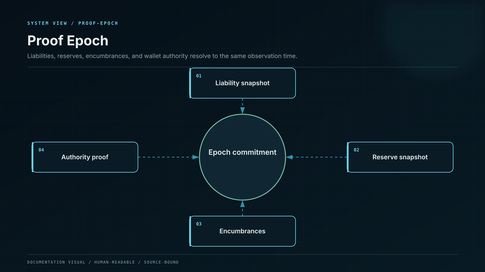
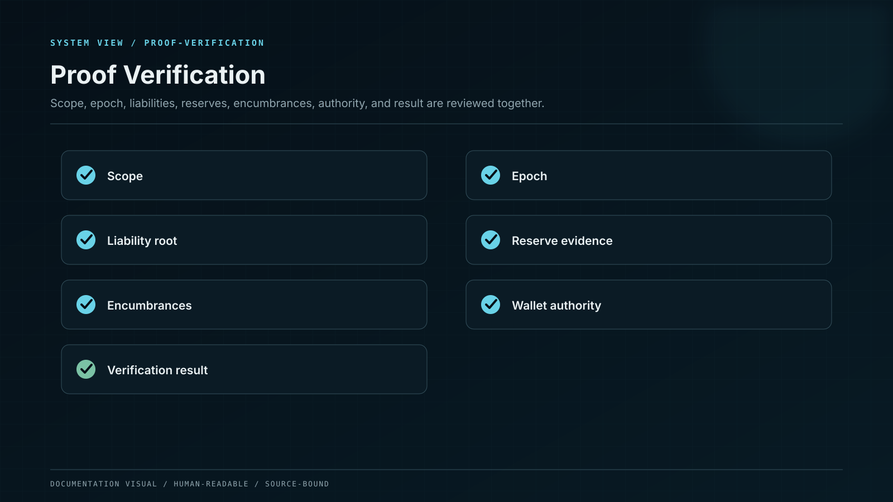

# Proof of Reserves and Liabilities

A same-epoch proof that binds customer liabilities, controlled reserves, encumbrances, and wallet authority.

Proof of Reserves is meaningful only when the asset side and liability side refer to the same scope and observation time. A wallet screenshot or list of addresses is not a solvency proof.



## Proof epoch

Each epoch contains:

* exact observation time and chain block for every network;
* asset and product scope;
* Merkle-sum commitment to customer liabilities;
* customer inclusion proof without exposing other customers;
* controlled wallet balances and ownership proofs;
* smart-contract and strategy positions valued under a published method;
* pending deposits, withdrawals, and settlement adjustments;
* encumbrances, borrowed assets, and third-party claims;
* required liquidity and safety buffers;
* signed manifest linking all components;
* previous-epoch hash for continuity.



## Liability commitment

The liability tree is generated from the double-entry ledger after closing the epoch. Leaves use domain-separated pseudonymous account commitments, per-epoch salts, canonical asset IDs, principal, posted reward, pending withdrawal, and applicable adjustments. Each included quantity has a non-negative range proof, and the aggregate proof binds the Merkle-sum root to the signed ledger close. Negative customer balances cannot reduce aggregate liabilities unless the legal and accounting basis permits netting within the same account and asset; every permitted netting rule is separately disclosed and tested.

## Reserve recognition

On-chain liquid balances are recognized at face quantity. Strategy and staked positions are recognized separately with protocol, withdrawal delay, slashing, counterparty, and valuation haircuts. Platform-owned capital is identified separately. Assets outside Whale CeFi control, unverifiable receivables, and circularly borrowed balances are excluded.

## Wallet control

Control is proven through signed challenges or equivalent cryptographic evidence tied to the epoch. A custodian attestation identifies the legal account, asset scope, restrictions, and observation time. Address ownership alone does not prove the absence of encumbrance, so encumbrances are a required part of the manifest.

## Coverage metrics

```
reserve coverage = recognized reserves / customer liabilities
liquid coverage  = immediately available reserves / near-term exits
encumbered ratio = encumbered reserves / gross reserves
```

Coverage is computed per canonical asset before any consolidated or cross-asset view, so an excess in one token cannot silently conceal a deficit in another. New exposure is blocked when the product-specific coverage or liquidity threshold is breached. Proof publication never authorizes a manual balance change; it verifies a closed ledger state.
