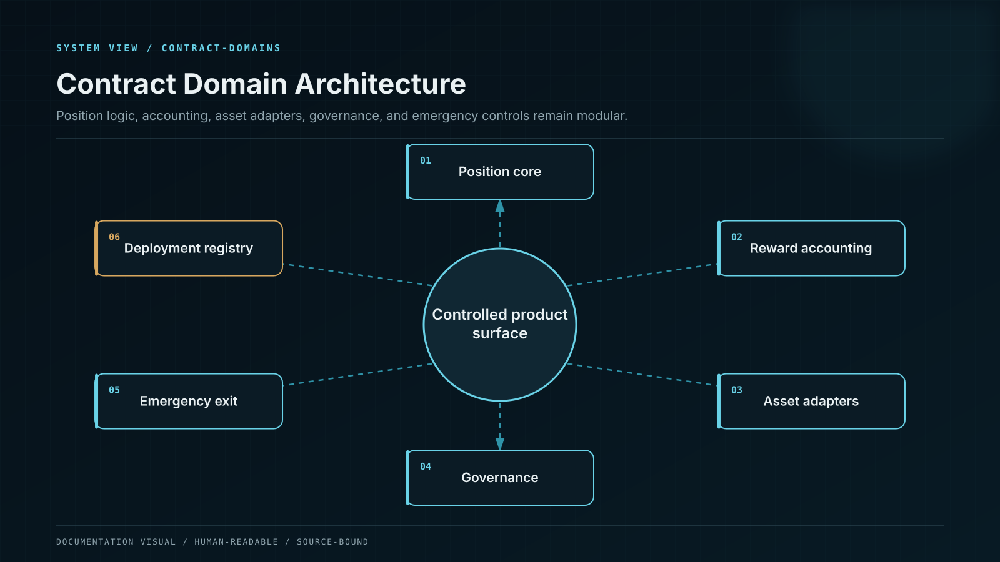

# Smart Contracts

A compartmentalized on-chain system that replaces the privileged monolithic staking contract.

The canonical contract system separates product definition, asset custody, position accounting, reward funding, strategy allocation, emergency control, and governance. No contract combines all of these powers, and no externally owned account can exercise privileged authority alone.

The published [Audit Findings and Remediation](smart-contracts/audit-findings-and-remediation.md) page links assessment `WCF-SARV-2026-0810`, its original PDF, SHA-256, exact-build closure result, and production-coverage boundary.

## Contract domains

| Module                | Responsibility                                                    | Asset authority                |
| --------------------- | ----------------------------------------------------------------- | ------------------------------ |
| AssetRegistry         | Canonical token identity, features, decimals, status, and adapter | None                           |
| PlanRegistry          | Immutable plan versions and capacity references                   | None                           |
| VaultFactory          | Deterministic deployment from approved bytecode                   | Deployment only                |
| FlexibleVault         | ERC-4626-compatible accounting for approved flexible products     | One registered asset           |
| LockedPositionManager | Fixed-term position lifecycle and maturity claims                 | One registered asset per vault |
| RewardEscrow          | Prefunded reward inventory and release schedule                   | Reward allocation only         |
| StrategyRouter        | Allowlisted adapters and exposure caps                            | Bounded allocation             |
| WithdrawalQueue       | Asynchronous exit requests and claim finalization                 | Bounded release                |
| EmergencyController   | Scoped pause and protective state transitions                     | No arbitrary transfer          |
| GovernanceTimelock    | Delayed privileged calls after quorum approval                    | Exact queued calldata only     |
| DeploymentRegistry    | Source, bytecode, role, audit, and activation identity            | None                           |

## Asset-bearing contracts are immutable

Vault implementations that hold principal are not upgraded in place. A new implementation creates a new plan version and a new deterministic vault address. Existing positions continue under their original code. Migration requires an explicit user or governed institutional action, preserves the old claim until the new claim is established, and is reversible before final settlement.

This design removes storage-layout corruption, implementation-slot takeover, and retroactive behavior changes from the principal custody boundary. Non-asset registries may use upgradeable patterns only when their state is reconstructable, their authority is timelocked, and the deployment manifest identifies every implementation transition.

## Value flow

1. The user or custody adapter transfers an allowlisted asset.
2. The vault measures the actual balance delta and validates it against the adapter policy.
3. A position or shares are created from the measured amount, never the requested amount alone.
4. Reward liability is backed by RewardEscrow or a recorded platform funding allocation with matched controlled assets before it becomes claimable.
5. Strategy allocation can move only the capped amount to an allowlisted adapter.
6. Withdrawal burns or closes the claim before external transfer and remains non-reentrant.
7. Every transition emits a complete event carrying position, product version, asset, amount, and causation identifiers.

## Standards boundary

Flexible single-asset vaults implement ERC-4626 where its share model matches the product. Fixed-term positions do not masquerade as ERC-4626 shares; their maturity and reward promise use a dedicated position interface. ERC-20 interactions use SafeERC20-compatible semantics, EIP-712 is used for typed approvals, and contract-account signatures are verified through ERC-1271 where applicable.

## Principal protection

Registered principal assets are permanently protected from generic rescue functions. A recovery operation may transfer only an unregistered token or a provable surplus above customer liabilities, pending withdrawals, accrued on-chain obligations, and required buffers. The recovery target is allowlisted, the call is timelocked, and the emitted event contains the pre- and post-operation solvency calculation.
