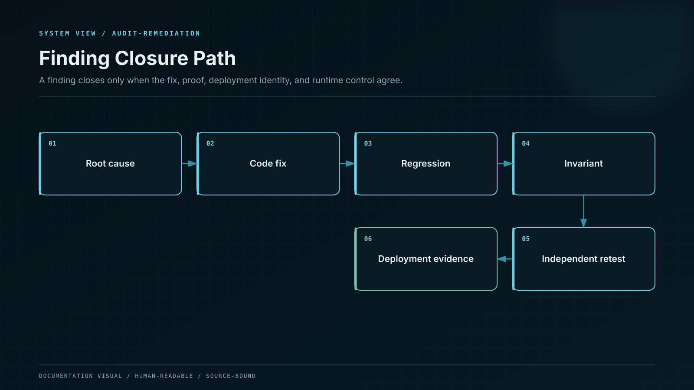

# Audit Findings and Remediation

Whale CeFi preserves a finding from original report through remediation, regression testing, independent retest, and deployment coverage.

## Assurance sources

The current target-state release contains independent security review records from **Eter** and **Hashlock**. The original reports remain immutable evidence. Implementation status is recorded separately so the project never rewrites an auditor’s historical conclusion.

## Closure contract

A finding can move through reported, accepted, remediating, remediated, retested, deployment-covered, superseded, or risk-accepted states. “Fixed” is not a valid evidence state by itself.

Each closure record contains:

- auditor and report identifier;
- finding ID, severity, description, and affected code;
- exact scope commit and dependency manifest;
- remediation pull request and commit;
- regression and invariant tests;
- independent retest record where required;
- deployment address and runtime bytecode hash;
- residual risk, owner, and expiry for any accepted exception.

## Deployment binding

An independently retested source commit is not automatically the code operating on-chain. The Deployment Registry binds compiler settings, bytecode, source commit, role configuration, timelock, and audit coverage to the active address.

No active deployment can accept new exposure when a blocking finding, scope mismatch, unknown runtime bytecode, or expired risk acceptance applies.
