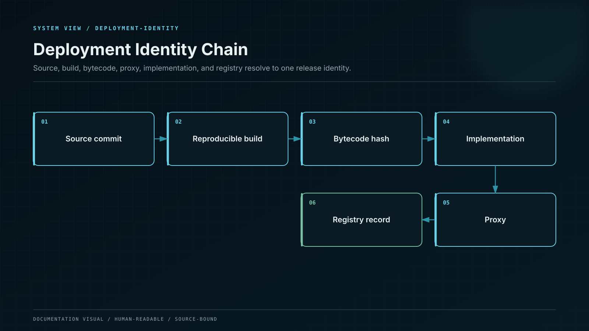

# Deployment Identity

A contract name or repository is not deployment identity. The canonical deployment record binds every relevant artifact to one chain address and one activation interval.

## Signed deployment manifest

| Manifest domain | Required evidence                                                                                                            |
| --------------- | ---------------------------------------------------------------------------------------------------------------------------- |
| Deployment      | Stable deployment ID, network namespace, canonical chain ID, address, creation transaction, and activation block             |
| Runtime         | Creation bytecode hash, runtime bytecode hash, linked libraries, constructor data, and proxy slots when applicable           |
| Source          | Repository identity, immutable commit, source-tree hash, compiler version, complete build settings, and dependency lock hash |
| Provenance      | Hermetic build record, SBOM, builder identity, independent rebuild result, and artifact signatures                           |
| Authority       | Resolved role members, smart-account threshold, timelock delay, emergency scope, and policy snapshot hashes                  |
| Assurance       | Audit-scope IDs, finding coverage, verification runs, and monitoring-policy version                                          |
| Lifecycle       | Effective interval, activation authorization, predecessor or supersession relationship, and retirement record                |
| Signatures      | Independent release and security signatures over the canonical manifest hash                                                 |

## Reproducible verification

The release pipeline builds from the pinned commit in a hermetic environment, generates an SBOM and signed provenance, compares the runtime bytecode with the manifest, and performs an independent rebuild. Constructor arguments and linked libraries are part of the identity. For proxies, proxy runtime, implementation runtime, implementation slot, admin, and initialization event are recorded separately.

## Registry behavior

Records are append-only and effective-dated. A role change, implementation change, timelock change, or emergency-controller change creates a new authority snapshot. An explorer badge or source-verification service is useful corroboration but does not replace the signed manifest.

## Consumer verification

The documentation and API resolve a product position to its product version, vault deployment, source build, authority graph, audit coverage, and supersession history. If any link is missing or mismatched, the deployment is shown as unverified and cannot accept new capacity.
