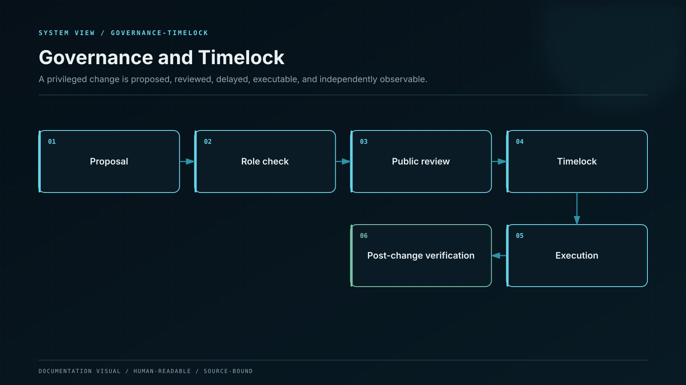

# Governance, Roles, and Upgrades

Privileged operations are slower, more observable, and more independently approved than routine user actions.

## Role topology

| Role              | Can                                             | Cannot                                 |
| ----------------- | ----------------------------------------------- | -------------------------------------- |
| Product proposer  | Submit a signed product or parameter change     | Execute or sign custody movement       |
| Security reviewer | Approve code and risk controls                  | Propose and execute alone              |
| Governance Safe   | Meet quorum and queue exact calldata            | Bypass timelock                        |
| Timelock executor | Execute matured queued calldata                 | Alter calldata or destination          |
| Emergency pauser  | Pause a scoped operation immediately            | Unpause, upgrade, rescue, or transfer  |
| Custody approver  | Approve a custody payload under policy          | Change product terms or ledger entries |
| Observer          | Monitor, alert, and cancel under defined policy | Create new privileged authority        |

Normal parameter changes have a minimum 48-hour delay. Code or authority changes have a minimum 72-hour delay. The delay begins only after the complete proposal — targets, values, calldata, implementation hashes, dependency manifest, rationale, simulation, and rollback analysis — is published to the governance record.

## Immutable vault migration

Principal vaults are replaced, not upgraded. A migration proposal deploys the new vault at a deterministic address, proves code identity, activates a new product version, and opens an opt-in migration path. The old vault remains capable of safe exit. A user or authorized institutional controller confirms the exact source position, destination vault, minimum received amount, and deadline.

## Upgradeable non-custody components

If a reconstructable registry or router uses a proxy, the deployment enforces initializer locking, implementation compatibility, storage-layout checks, role separation, and timelocked authorization. A proxy upgrade creates a new deployment-manifest version and immediately recomputes audit coverage.

## Cancellation and veto

Security observers can cancel a queued operation when decoded behavior, code identity, simulation, dependency, or policy no longer matches the approved proposal. Cancellation cannot create a different operation. A cancelled change must be proposed again from the beginning.

## Post-execution verification

Execution is followed by automated checks of bytecode, implementation slots, role membership, timelock configuration, vault solvency, product registry, event sequence, service compatibility, and monitoring coverage. A mismatch moves the affected domain to a contained state and prevents further privileged operations.
