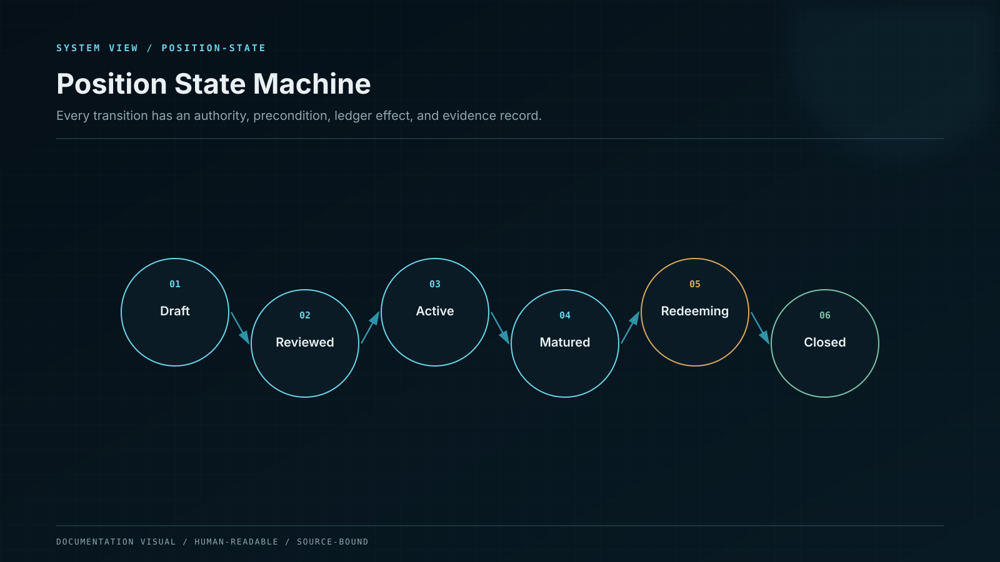

# On-Chain Position State Machine

Position state is explicit; timestamps and balances alone are not used to infer an unrecorded transition.

## States

| State         | Meaning                                    | Permitted next states             |
| ------------- | ------------------------------------------ | --------------------------------- |
| Created       | Identifier reserved; no asset accepted     | Funded, Cancelled                 |
| Funded        | Measured asset received                    | Active, Refunding                 |
| Active        | Position accrues under its product version | Matured, ExitRequested, Paused    |
| Matured       | Locked term completed                      | ExitRequested, Closed             |
| ExitRequested | Claim reserved for withdrawal              | Settling, Cancelled where allowed |
| Settling      | External release committed                 | Claimable, Failed                 |
| Claimable     | Assets available to the beneficiary        | Closed                            |
| Paused        | A scoped protective control is active      | Active, ExitRequested             |
| Closed        | Principal and due reward settled; terminal | None                              |
| Cancelled     | No active claim remains; terminal          | None                              |

## Transition rule

Every transition verifies current state, caller role, product version, asset status, amount, deadline, and idempotency key. Effects are written before external interaction, and a non-reentrancy guard protects all value-moving entry points. If an external call fails, the state either reverts atomically or moves to a named recoverable state; it never remains ambiguously half-complete.

## Restaking

Restaking does not mutate the original term enum. At maturity, the old position closes and a new position opens against the then-current product version. The journals and events link the two positions. This removes the former ambiguity over whether a new period must be equal to or greater than the old period.

## Aggregate accounting

`totalPrincipal` increases by the measured deposit amount and decreases by the principal extinguished at claim or refund. Reward and penalty amounts never modify `totalPrincipal`. Aggregate values are checked against the sum of active position principal in invariant tests and against vault balance plus authorized strategy receivables during reconciliation.
