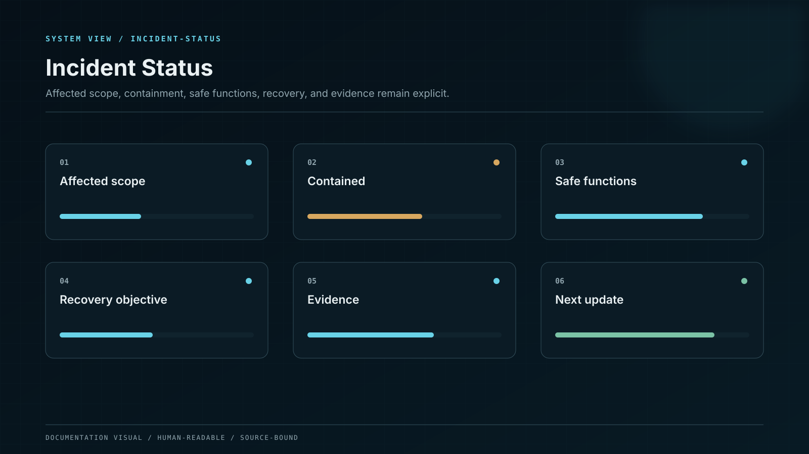
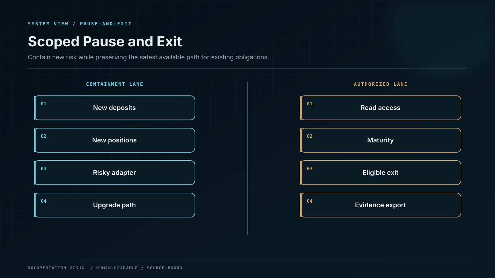

# Pause and Emergency Exit

Emergency control is split by operation, asset, network, product version, and contract module. There is no universal owner switch capable of both freezing and draining the system.

## Pause scopes

* New deposits
* New position opening
* Strategy allocation
* Reward claiming
* Position migration
* Withdrawal request creation
* Withdrawal fulfillment
* One asset or adapter
* One network or deployment

The pauser can activate a pre-defined scope immediately. It cannot transfer assets, modify accounting, change a product version, upgrade code, or disable monitoring. Unpause requires root-cause evidence, reconciliation, security approval, governance quorum, and timelock.

## Exit priority

When a strategy or deposit path is unsafe but principal remains available, the system preserves controlled user exit. Withdrawal fulfillment is paused only when executing it would worsen loss, violate finality, or create double settlement. A withdrawal pause automatically activates heightened reconciliation and a published recovery state.

## Break-glass

Break-glass access is short-lived, purpose-bound, device-bound, and approved by independent Security and Operations roles. It grants only a named action against a named resource. Use produces a tamper-evident incident record and cannot be converted into a persistent role.

## Reopening

Reopening proceeds from read-only observation to limited canary activity, then to normal capacity. Each step requires current reserve coverage, zero unexplained reconciliation variance, healthy dependencies, and explicit approval. A failed canary automatically returns to the prior safe state.
