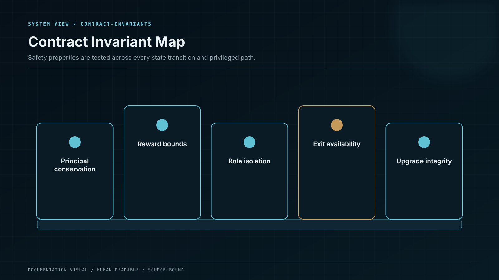

# Smart-Contract Invariants

Properties that hold across every transaction sequence, including adversarial and failure paths.

An invariant is stronger than an example test: it must hold for every reachable state under the stated assumptions.

## Solvency and accounting

1. `protectedAssets + recognizedStrategyReceivables ≥ activePositionPrincipal + pendingPrincipalSettlement + claimableRewardLiability + pendingRewardSettlement`.
2. `activePositionPrincipal` equals the principal assigned to accrual-bearing or matured positions; `pendingPrincipalSettlement` equals the principal reserved by unsettled exits.
3. A principal unit belongs to exactly one liability bucket and can never be counted in both an active position and pending settlement.
4. A closed or cancelled position cannot accrue, restake, withdraw, or close again.
5. A withdrawal cannot settle more than the reserved claim.
6. A reward release cannot exceed the cohort's escrowed or otherwise authorized funding.

## Authority

1. No EOA is the sole holder of an administrative role.
2. The pauser cannot upgrade, transfer assets, change rates, or unpause.
3. The proposer cannot execute its own privileged action without timelock and quorum.
4. The timelock cannot shorten its own minimum delay in the same operation.
5. A strategy adapter cannot call an unregistered target or exceed its asset and exposure cap.
6. WENI and application services hold no on-chain signing role.

## Asset safety

1. Claims are minted from measured balance increase, not requested transfer amount.
2. Every external token operation either succeeds under accepted semantics or reverts.
3. Protected assets cannot be rescued.
4. Slashing is not blocked by the minimum collateral rule applied to voluntary withdrawal.
5. Slashing that moves a node below minimum collateral marks it undercollateralized and blocks new allocation.

## Lifecycle

1. Product terms referenced by an active position never change.
2. Time moves a position only when an explicit state transition is executed.
3. Pause prevents the named operation and no broader operation than declared.
4. Safe exit remains available during a deposit or strategy pause when solvency permits.
5. Event fields reproduce the state transition without querying mutable off-chain metadata.

## Verification strategy

The invariant suite runs under randomized callers, amounts, tokens, time jumps, reorg simulations, adapter failures, governance sequences, and callback attempts. Differential tests compare contract accounting with an independent mathematical model. Each former audit finding has a regression test that fails against the legacy behavior and passes against the canonical implementation.
