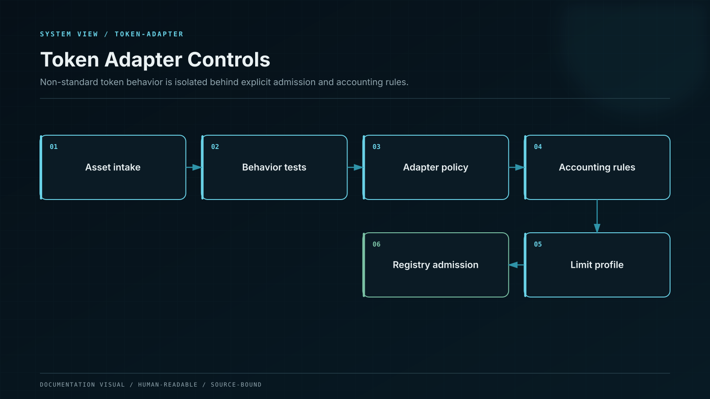

# Token Integration Safety

Token symbols do not define behavior. Every supported asset is admitted through a dedicated adapter profile and a complete adversarial test suite.



## Transfer semantics

All token calls use SafeERC20-compatible wrappers that accept compliant empty returns and require a successful boolean result when one is returned. The system never ignores the result of `transfer`, `transferFrom`, `approve`, or permit validation.

Deposits use balance-delta accounting:

```
before = token.balanceOf(vault)
safeTransferFrom(sender, vault, requested)
after = token.balanceOf(vault)
received = after - before
```

The created claim is based on `received`. For standard assets, policy requires `received == requested`. Fee-on-transfer assets are rejected unless a specialized product version explicitly prices and discloses their behavior. Rebasing assets are wrapped or isolated; they are never mixed with nominal fixed-principal accounting.

## Protected behaviors

* Zero addresses are rejected for assets, beneficiaries, burn sinks, governance targets, adapters, and recovery destinations.
* Contract-code presence is verified where an address must be a contract.
* Asset decimals are read where the token exposes them, independently verified against canonical issuer data, pinned in the registry, and checked against adapter behavior. Tokens with missing or inconsistent decimals remain inactive.
* Internal arithmetic uses `uint256`; packed storage casts use SafeCast-compatible bounds checks.
* Amount, rate, multiplier, fee, penalty, timestamp, and duration have explicit upper bounds.
* Permit signatures bind chain ID, contract, owner, spender, amount, nonce, and deadline.
* Approvals use exact amounts or force-reset semantics; unlimited allowances require a separate risk-approved adapter policy.
* Callback-capable tokens cannot re-enter state-changing functions.

## Rescue policy

`rescueToken` rejects every registered principal token, registered reward token, vault share, position receipt, and strategy claim token. For an unregistered asset it can transfer no more than the measured balance. For a registered but surplus asset, a dedicated surplus-release path proves:

```
controlled balance
- customer principal liability
- claimable reward liability
- pending withdrawals
- strategy settlement reserve
- safety buffer
>= requested surplus release
```

The calculation is performed on-chain where possible and corroborated by the financial control plane before the timelocked call executes.
