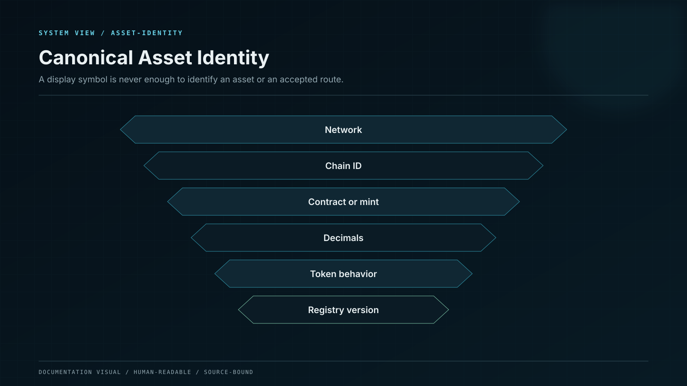
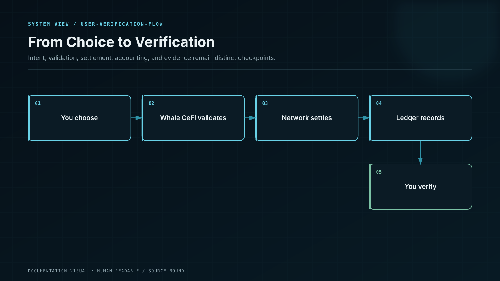

# Crypto without Jargon

You do not need to become a blockchain engineer to use a digital asset safely. You only need a reliable mental model for the few decisions that can move value.

## Think of a shared notebook

Imagine a notebook copied across many independent computers. When a valid transfer is added, the computers agree on the next page. Old pages are difficult to change without the network noticing. That shared, tamper-evident notebook is a useful first model of a **blockchain**.

A digital asset is an entry governed by that notebook's rules. It is not a file stored inside an app. An app helps you view the entry and authorize instructions; the network records what finally happened.

| Word                       | Everyday analogy                         | What it really means                                 |
| -------------------------- | ---------------------------------------- | ---------------------------------------------------- |
| Blockchain                 | A shared notebook                        | A network that orders and validates changes          |
| Asset                      | A type of value recorded in the notebook | A native coin or token on a particular network       |
| Address                    | A delivery location                      | A public identifier that can receive an asset        |
| Wallet                     | A key ring                               | Software or hardware that controls signing authority |
| Private key or seed phrase | The master key                           | Secret material that can authorize movement          |
| Transaction                | A signed delivery instruction            | A request to change blockchain state                 |
| Network fee                | Delivery cost                            | Payment for processing and recording a transaction   |
| Confirmation               | More pages written after a transfer      | Evidence that reversal has become less likely        |
| Smart contract             | A vending machine with public rules      | Code the network executes when conditions are met    |

## A token symbol is not a complete identity

The label `USDT`, `USDC`, or `ETH` is only the name shown on screen. A complete asset identity includes:

```
network + chain ID + contract address + decimals + token behavior
```

Two tokens can display the same symbol while existing on different networks or under different contracts. Whale CeFi therefore validates the full route rather than trusting the symbol alone.



## Where Whale CeFi fits

Whale CeFi does not replace the blockchain. It adds the parts a financial product needs: accepted terms, account controls, accounting, custody policy, reward attribution, risk limits, reconciliation, statements, and support.



## The distinction that prevents many mistakes

* **The interface** shows information and collects intent.
* **The ledger** records what the platform owes.
* **Custody** controls asset movement under policy.
* **The blockchain** records external settlement.
* **Reconciliation** checks that those records agree.

A green button or success message is not, by itself, proof that every layer has completed.
