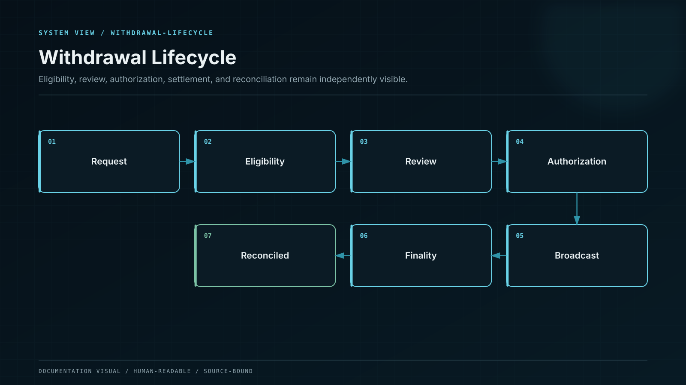
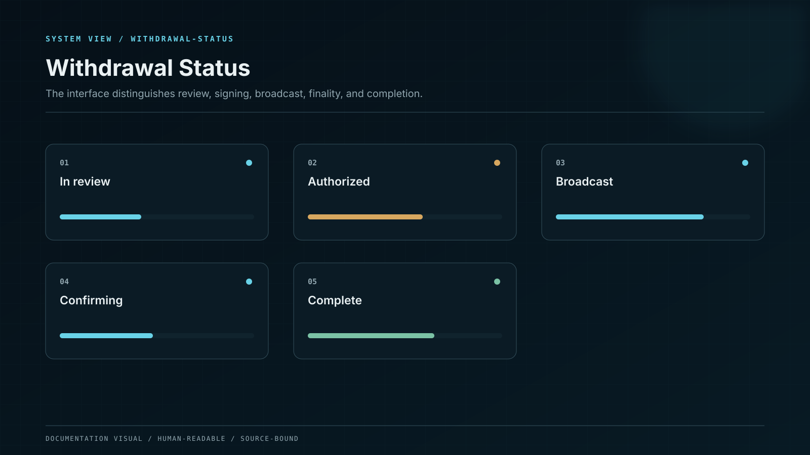

# Maturity and Withdrawal

Maturity, position closure, and blockchain withdrawal are related but separate events.

## Maturity

A fixed-term position reaches maturity at the timestamp defined by its accepted product version. Maturity makes the position eligible for settlement; it does not mean an external blockchain transaction has already finalized.

## Closing a flexible position

A flexible position follows the closure rule shown at confirmation. Applicable notice, adjustment, availability, and settlement conditions are applied from the accepted version rather than from a later product page.

## The withdrawal lifecycle

1. **Requested** — you choose the asset, network, destination, and amount.
2. **Reviewed** — the interface shows fees, limits, and the exact destination.
3. **Policy checked** — account, route, sanctions, limits, and risk controls are evaluated.
4. **Approved** — the required user or institutional approval is bound to the exact payload.
5. **Signed and broadcast** — custody or the external wallet signs; the transaction enters the network.
6. **Finalized** — the network-specific finality rule is met.
7. **Reconciled** — the ledger obligation and external asset movement agree.

## Check the destination twice

Blockchain transfers are usually irreversible. Verify the address, network, memo or tag, amount, and fee. When the destination is new, use the smallest practical test transfer first.

## What a delay means

A delay is not automatically a loss. The visible state should identify whether the operation is waiting for approval, custody processing, network inclusion, finality, or reconciliation. Creating a duplicate withdrawal can make investigation harder and does not accelerate the original request.


The withdrawal is complete only after external finality and financial reconciliation, not when a transaction is merely created or signed.

