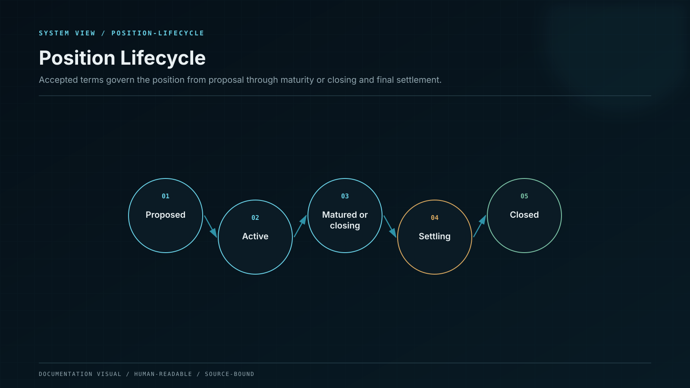
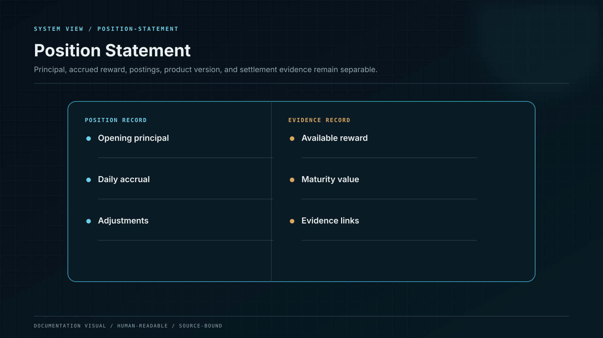

# Open and Track a Position

Opening a position converts an available balance into a versioned financial obligation. It is not just a button state.

## Before confirmation

The review screen answers eight questions in plain language:

1. Which asset and amount leaves the available balance?
2. Which plan and product version apply?
3. When does reward eligibility begin?
4. How is reward calculated?
5. When does the position mature?
6. How can it be closed?
7. Which fees or adjustments apply?
8. Which material risks remain?

## Confirmation binds a stable object

Your approval is attached to an exact review object. A change to the amount, network, rate, term, fee, source policy, or risk disclosure invalidates that review. The system must present the changed object again.

## What happens after confirmation

The ledger reserves principal, creates the position liability, attaches the accepted product version, and begins eligible accrual only after the acceptance boundary completes.

## Reading the position statement

The statement keeps four amounts separate:

* **Principal** — the amount committed to the position;
* **Accrued reward** — reward calculated for completed eligible intervals;
* **Available reward** — reward posted and eligible under the product rules;
* **Pending settlement** — an amount moving through closure or withdrawal states.

Each reward line resolves to the calculation interval, rate version, eligible principal, rounding rule, journal identifier, and source attribution.

## Auto-Reinvest

Accrued reward does not silently become principal. Auto-Reinvest is a separate, revocable instruction. Each reinvestment creates a new accepted financial event and preserves the original reward history.
