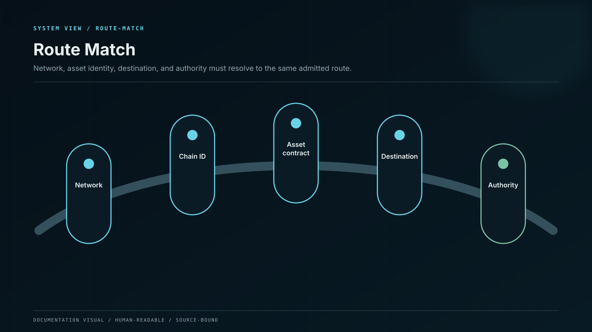

# Wallets, Networks, and Addresses

## Wallet: who can authorize?

A wallet manages signing authority. It may be an app, a browser extension, a hardware device, or an institutional approval system. The wallet does not physically contain a token; it controls the key that can authorize an instruction recognized by the network.

Your seed phrase or private key is the recovery path to that authority. Anyone who obtains it can usually act without asking the platform for permission.


Whale CeFi support never needs your seed phrase or private key. Do not enter it into a form, send it in a message, or share a screen that reveals it.


## Network: which railway is carrying the asset?

Ethereum, BNB Chain, Solana, Polygon, Arbitrum, and other networks are separate settlement systems. An address format may look familiar across more than one network, but the routes remain different.

Choosing the wrong network is similar to sending a package through the wrong national postal system: the written destination may look valid while the route is incompatible.

## Address: where should this transfer arrive?

A deposit address is a public destination assigned to an account and route. Some assets also require a memo, tag, or destination identifier. The address and any secondary identifier must be copied exactly from the authenticated deposit screen.

## Before you send

Confirm all five fields:

1. the asset;
2. the network;
3. the destination address;
4. the memo or tag, if required;
5. the amount and network fee.

## Why confirmations differ

Networks reach practical finality in different ways. Whale CeFi uses an asset- and network-specific confirmation policy. A transfer may be visible before it is safe to credit. The deposit screen therefore separates `Detected`, `Confirming`, `Credited`, and `Reconciled` instead of calling every observed transaction complete.

## Safe first use

When a route is unfamiliar, send a small test amount first. Wait until it is credited to the expected account, then repeat the same verified route for the remaining amount.
