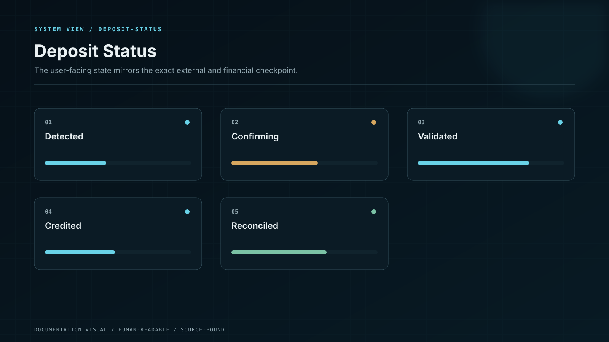

# Your First Deposit

A safe deposit is a sequence, not a single transfer.

## 1. Open the deposit screen

Sign in through the official Whale CeFi entry point. Select the asset first, then the network. The system shows only routes admitted by the current asset registry.

## 2. Read the route as one instruction

The deposit object contains the account, asset, network, address, memo or tag requirement, minimum amount, confirmation rule, and route expiry. Copying only the visible symbol is not enough.

## 3. Verify the sending platform

The network selected on the sending wallet or exchange must match the Whale CeFi deposit network exactly. Review the fee and the amount that actually leaves the sender.

## 4. Send a small test when needed

A test transfer reduces the cost of a copied-address or wrong-network mistake. It does not remove the need to verify every field again for the full transfer.

## 5. Follow the visible states

| State          | Meaning                                      | What you should do                                                   |
| -------------- | -------------------------------------------- | -------------------------------------------------------------------- |
| Address issued | The route is ready                           | Verify every field before sending                                    |
| Detected       | The network has seen the transaction         | Do not send the same transfer again                                  |
| Confirming     | Finality requirements remain incomplete        | Wait; network conditions determine timing                            |
| Credited       | The ledger has recorded an available balance | Review the amount and transaction reference                          |
| Reconciled     | Ledger, custody, and chain evidence agree    | The deposit lifecycle is complete                                    |
| Exception      | A field or external state needs review       | Follow the in-product case record; do not create duplicate transfers |

## What can delay credit

* insufficient network confirmations;
* a chain reorganization or network halt;
* an unsupported token contract;
* a missing memo or tag;
* an amount below the route minimum;
* a transfer from a restricted or incompatible route;
* custody or reconciliation evidence that remains inconsistent.


The transaction hash is your external receipt. Keep it until the deposit appears as `Reconciled`.


For the deeper system model, continue to [Deposits and Credit Finality](../earning-with-whale-cefi/deposits-and-credit-finality).
