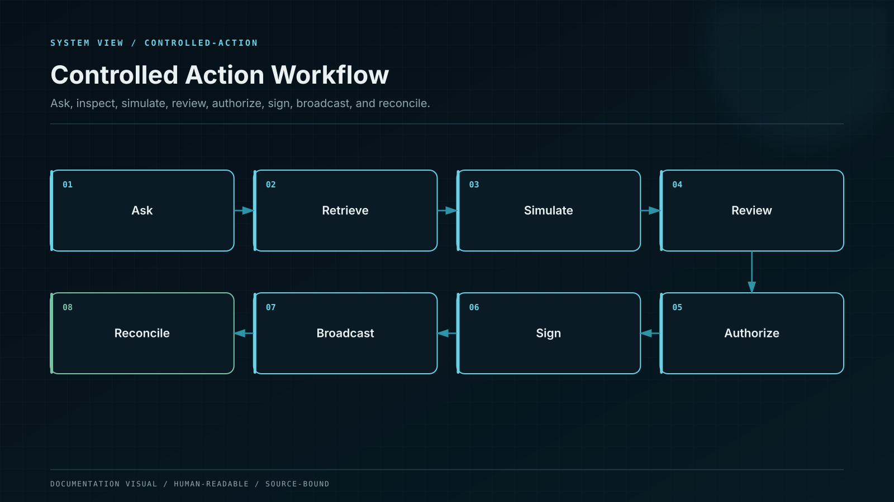
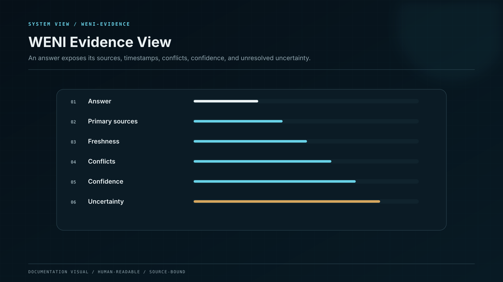

# Controlled Action Workflow

How evidence and reasoning become an unsigned proposal that stops before human authorization.

WENI can move from explanation to preparation without acquiring execution authority.

## Lifecycle

1. **Intent** — the request is classified without executing it.
2. **Identity and scope** — tenant, user, permissions, product, and retention policy are fixed.
3. **Evidence plan** — required sources, time bounds, and deterministic checks are defined.
4. **Evidence bundle** — observations are collected at pinned blocks and timestamps.
5. **Reasoning** — WENI builds alternatives, assumptions, and failure conditions.
6. **Tool verification** — deterministic services recalculate balances, routes, gas, and policy.
7. **Critic pass** — narrative and tool evidence are compared for contradiction.
8. **Policy decision** — the output is limited to explain, compare, simulate, or prepare.
9. **Unsigned proposal** — a typed payload is built with exact destination, calldata, value, limits, and expiry.
10. **Human review** — the wallet or institutional approval chain independently decodes and authorizes the payload.
11. **Execution observation** — WENI may explain the resulting transaction but cannot submit an undisclosed substitute.

## Iron Boundary

The boundary is technical, not rhetorical:

* no seed phrase, private key, MPC share, session signer, or unrestricted relayer credential enters the WENI runtime;
* the Tool Broker exposes no generic shell, arbitrary HTTP, arbitrary contract call, or broad database write;
* the Payload Builder produces a canonical unsigned representation;
* the confirmation surface independently decodes the payload from bytes;
* any material change after review invalidates approval;
* policy and wallet rules remain authoritative even if the user asks WENI to bypass them.

## Output states

`EXPLAIN`, `COMPARE`, `SIMULATE`, `PREPARE`, `REQUIRE_MORE_EVIDENCE`, `CONFLICT`, `STALE`, `POLICY_BLOCK`, and `UNAVAILABLE` are first-class states. A blocked or uncertain request is not rewritten into a confident answer.
