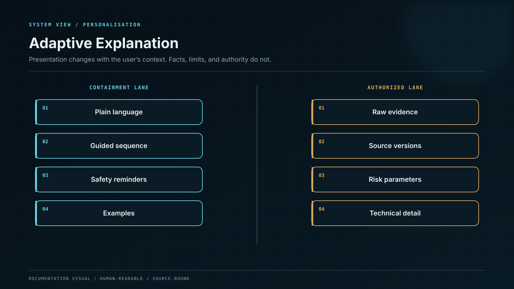

# Personalisation and Memory

## What may be personalised

* explanation depth and vocabulary;
* preferred units, formats, and interface density;
* learning history and demonstrated competency;
* declared goals, time horizon, and risk preferences;
* saved watchlists or approved workspace context;
* the order in which evidence and warnings are presented.

## What is never personalised away

* material risk information;
* current evidence and source conflict;
* legal or product eligibility;
* mandatory security checks;
* transaction details requiring explicit review;
* uncertainty that affects the conclusion.

## Sovereign memory control

The memory model is purpose-bound and user-governed. A user can inspect which categories are stored, why they are used, how long they are retained, and how to correct, export, or delete them where applicable.

Sensitive raw content such as voice, screenshots, documents, or wallet context does not become permanent model memory automatically. It is processed within an authorised boundary; only the minimum approved structured state persists under explicit retention and deletion rules.

## No hidden risk profiling

Inferred emotion, sophistication, or behaviour never becomes a hidden reason to push a financial action. Personalisation improves comprehension and control; it does not exploit vulnerability.
