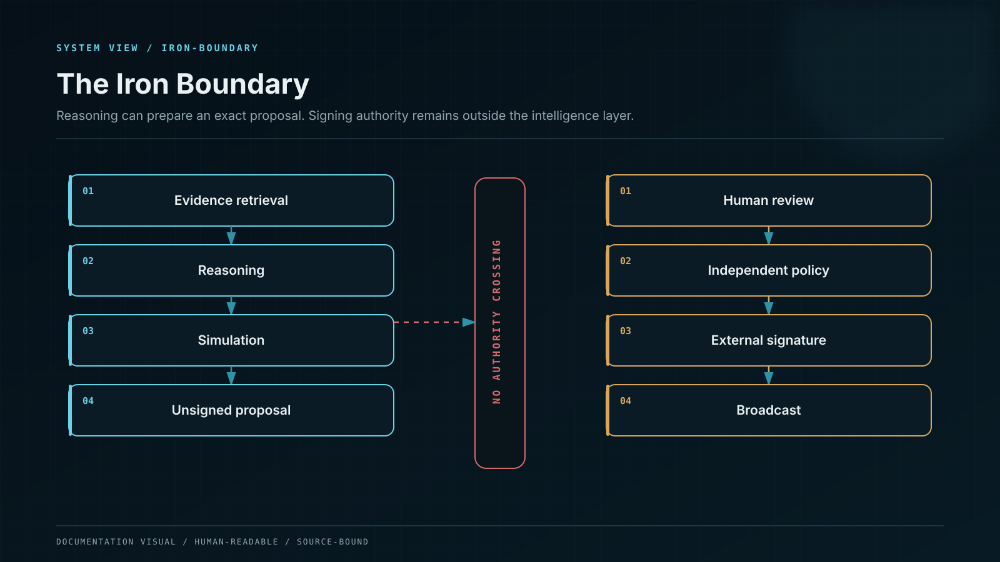

# The Iron Boundary

The Iron Boundary is the non-negotiable separation between intelligence and asset authority.

WENI may be permitted to:

* interpret intent;
* retrieve and organise evidence;
* reason and critique;
* call approved calculation and analysis services;
* simulate bounded outcomes;
* apply mandatory policy;
* prepare an unsigned and expiring request;
* and explain the rationale for review.

WENI stops before:

* accessing a private key or seed phrase;
* producing an undisclosed autonomous signature;
* bypassing the user’s wallet or approved enterprise signing policy;
* changing a reviewed request after approval;
* or treating prior consent as permission for a materially different state.

## State binding

The reviewed request is bound to the material state: chain, asset, amount, contract, recipient, function, permissions, slippage, fee or gas limits, deadline, simulation, policy version, and other relevant constraints.

If any bound element changes, the request returns to review.

## Enterprise boundary

For an institution, final authority may require multiple approvers, a policy engine, a custody workflow, and multisignature control. WENI may support the preparation and evidence package, but it does not replace the organisation’s authorised approval chain.

## Why the boundary matters

AI errors are possible. Data can be stale. Tools can fail. Providers can disagree. Interfaces can be attacked. Preserving external cryptographic authority ensures that an intelligence-system output is never, by itself, sufficient to move assets.
