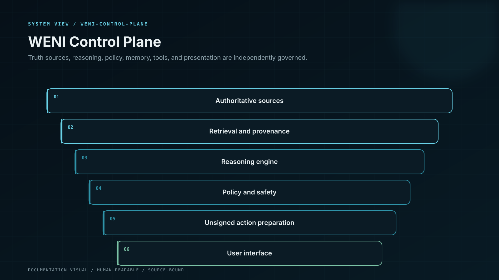

# WENI System Architecture

WENI operates as a governed intelligence system rather than one model with unlimited access.

## 1. Experience layer

Conversational, dashboard, mobile, voice, document, and enterprise interfaces collect intent and present evidence at an appropriate depth.

## 2. Identity, consent, and context

The system establishes who is acting, which workspace or account is in scope, what information may be used, and which permissions or retention rules apply.

## 3. Evidence plane

Approved data is collected, licensed, normalised, versioned, attributed, and associated with freshness, confidence, and conflict state.

## 4. Intelligence plane

Domain-adapted reasoning, retrieval, planning, comparison, and critique operate over a bounded context. Model output remains probabilistic.

## 5. Deterministic service plane

Calculation, simulation, contract analysis, policy evaluation, product eligibility, and payload construction use controlled services and pinned inputs.

## 6. Iron Boundary

The system may prepare an unsigned request. Final asset authority remains with the user-controlled wallet or authorised enterprise approval system.

## 7. Decision and audit plane

A structured record preserves relevant inputs, versions, assumptions, limitations, tool results, policy outcomes, review state, and final disposition.

No single layer is allowed to silently become every authority. The language model cannot rewrite authoritative evidence. A deterministic calculation cannot establish legal eligibility without policy. A policy decision does not prove chain state. An attractive interface does not prove any underlying control.
