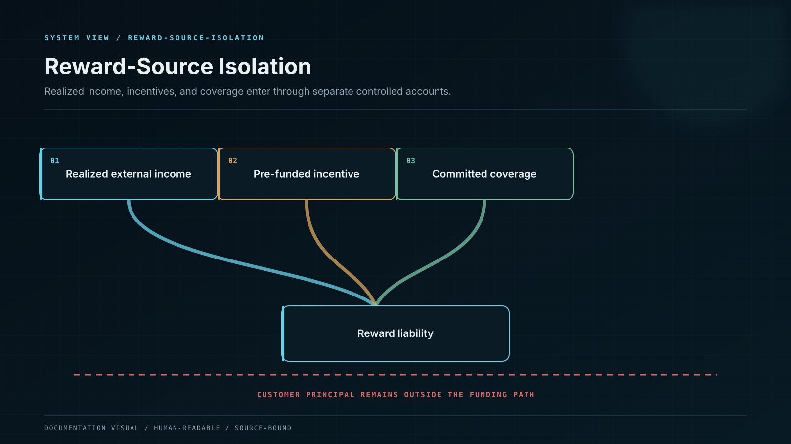

# Yield and Financial Transparency

Reward begins with economic value, not with a percentage on a screen.

Whale CeFi recognizes yield only when value has been produced by an approved source or released from an already funded budget. A reward promise is a liability. A forecast is not funding.

## Constitutional separation

| Economic class           | Meaning                                                     | Permitted use                                                                    |
| ------------------------ | ----------------------------------------------------------- | -------------------------------------------------------------------------------- |
| Customer principal       | Asset owed to the user                                      | Custody, approved strategy deployment, and settlement back to the entitled user  |
| Realized external income | Income settled under an approved recognition rule           | Costs, reserves, user rewards, and residual platform revenue under the waterfall |
| Reward liability         | Amount owed under an active product version                 | Settlement to the entitled user only                                             |
| Incentive escrow         | Finite capital committed before the reward is offered       | The named product, cohort, asset, and period only                                |
| Coverage capital         | Platform-owned loss-absorbing or reward-support capital     | Declared shortfall and resolution rules                                          |
| Platform revenue         | Residual earned after costs, reserves, and user obligations | Corporate use after recognition and reconciliation                               |

## Anti-pyramid invariants

1. A new user's principal cannot settle an older user's reward.
2. Principal, reward funding, fees, and platform capital occupy distinct ledger accounts and custody scopes.
3. A fixed reward obligation cannot be created without forward funding coverage.
4. Variable yield cannot be presented as a fixed promise.
5. Unrealized token appreciation, unclaimed emissions, or projected strategy profit cannot be credited as realized reward funding.
6. Capacity closes automatically when funding, liquidity, solvency, counterparty, custody, network, legal, or operational limits are reached.
7. Referral and gamification rewards use finite, separately identified budgets.
8. Every correction posts through a new journal; historical yield is never edited in place.

## Position-level source binding

Every position stores a `funding_policy_id`. The policy identifies permitted sources, allocation priority, fee split, reserve target, prefunded amount, capacity reservation, loss treatment, maturity match, and change authority.

Because the funding policy is bound to the position version, the original economics remain reproducible even after the public catalogue changes.


**Source-of-funds test:** a reward must be traceable from the user statement to a ledger journal, funding account, external settlement or escrow release, and source evidence.

