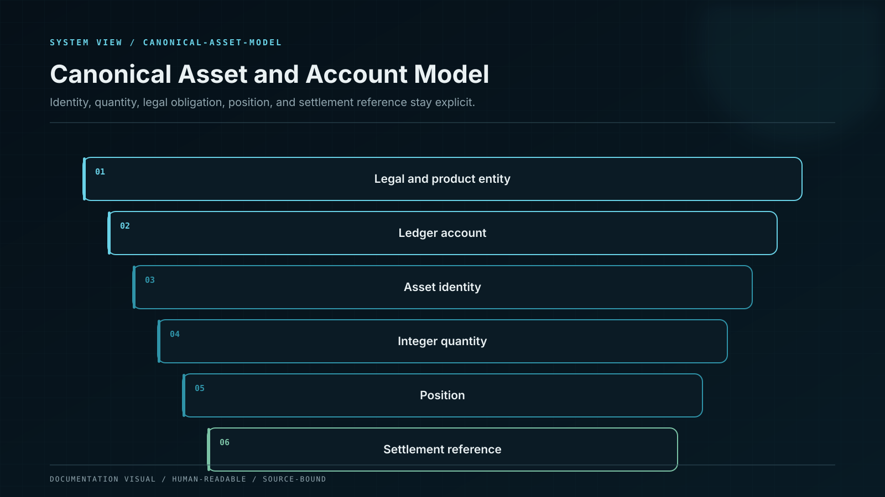

# Canonical Asset and Account Model

Every financial record depends on a canonical definition of entity, account, asset, network, quantity, precision and liability. The model prevents symbol ambiguity and separates user liability, platform asset, pending settlement, fee, yield and reward states.

## Control model

| Component or state   | Responsibility                                                    |
| -------------------- | ----------------------------------------------------------------- |
| Legal/product entity | Which entity owes or controls the balance.                        |
| Ledger account       | Asset, liability, income, expense, equity or memorandum class.    |
| Asset identity       | Network plus contract/mint plus decimals and behaviour.           |
| Quantity             | Integer base units with explicit rounding and display conversion. |
| Position             | Term, product, principal, accrued state and lifecycle.            |
| Settlement reference | Chain transaction, custody transfer or internal movement.         |

## Invariants

* Store authoritative quantities in integer base units or exact decimal types.
* Symbols and display decimals never define asset identity.
* Separate available, pending, locked, accrued and disputed amounts.
* Every account belongs to one entity, currency and purpose.
* Cross-network representations of the same symbol remain distinct assets.

## Failure containment

| Failure          | Effect                           | Control               | Response |
| ---------------- | -------------------------------- | --------------------- | -------- |
| Unit error       | Amount differs by decimal factor | Typed base units      | BLOCK    |
| Asset conflation | Bridged and native token mixed   | Canonical identity    | REJECT   |
| State conflation | Pending funds shown available    | Balance buckets       | HOLD     |
| Entity ambiguity | Wrong company carries liability  | Entity-bound accounts | ESCALATE |

## Operational evidence

* Canonical asset and network identifiers.
* Chart of accounts and entity ownership model.
* Quantity, decimal and rounding specification.
* Available/pending/locked/accrued state tests.
* Cross-network and token-variant test vectors.

## Boundary conditions

The public token symbol is never treated as sufficient financial or technical identity.
