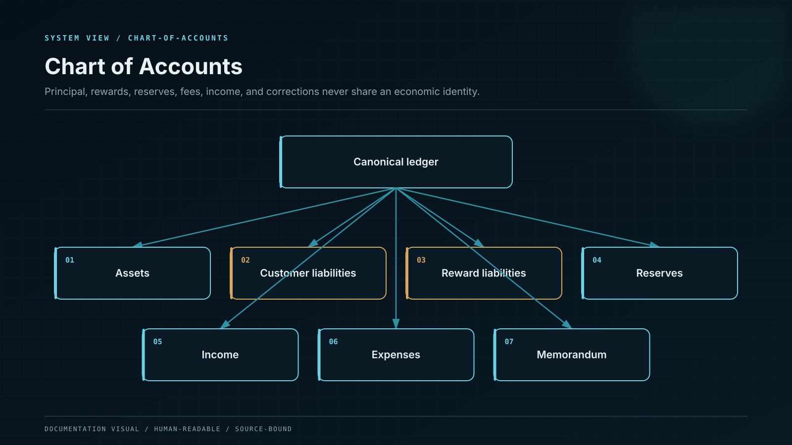

# Double-Entry Ledger Service

The Accounting Ledger Service is the internal financial source of record. Every economic event posts a balanced, immutable journal transaction; balances are projections of entries, not independently mutable fields.

## Control model

| Component or state  | Responsibility                                                       |
| ------------------- | -------------------------------------------------------------------- |
| Economic event      | Validated deposit, withdrawal, fee, yield or correction instruction. |
| Posting rule        | Versioned mapping from event to debit and credit accounts.           |
| Journal transaction | Atomic balanced entries with unique reference.                       |
| Integrity chain     | Tamper-evident sequencing, hashes and audit metadata.                |
| Balance projection  | Derived available, pending and locked balances.                      |
| Reversal/correction | New entries preserve history and repair state.                       |

## Invariants

* Database constraints reject unbalanced or duplicate postings.
* Posted entries are never updated or deleted in routine operation.
* Every posting rule carries code version, business reason and approver.
* External references are unique within network/provider scope.
* Corrections use reversal and replacement entries under controlled authority.

## Failure containment

| Failure             | Effect                          | Control                  | Response             |
| ------------------- | ------------------------------- | ------------------------ | -------------------- |
| Unbalanced journal  | Assets and liabilities diverge  | Atomic constraint        | HALT                 |
| Duplicate event     | User credited twice             | Unique idempotency key   | REJECT               |
| Direct balance edit | Audit trail is destroyed        | No mutable authority     | DENY                 |
| Posting-rule defect | Consistent but wrong accounting | Versioned tests/reversal | Reject and reconcile |

## Operational evidence

* Ledger schema, constraints and posting-rule catalogue.
* Golden journals for every product lifecycle.
* Duplicate, concurrency and rollback tests.
* Tamper-evidence and privileged-access review.
* Reversal/correction and period-close procedures.

## Boundary conditions

Kafka, UI balances and analytical projections are not permitted to replace the ledger journal as accounting authority.
