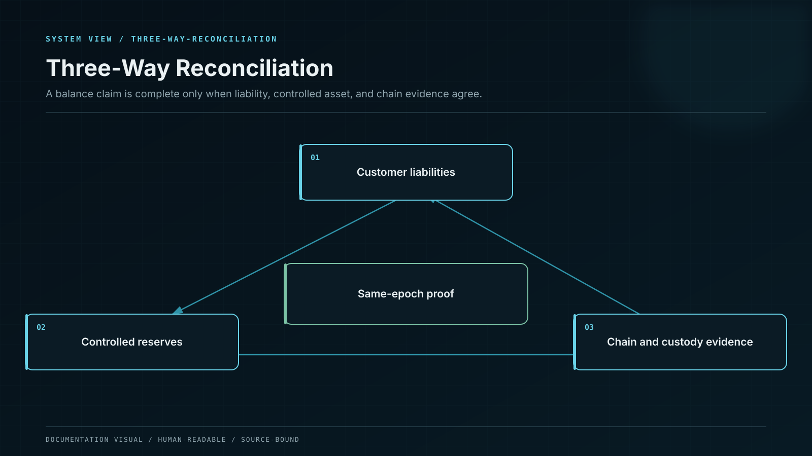
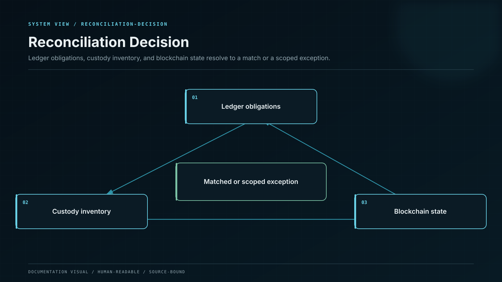

# Ledger, Reconciliation, and Proof

## Double-entry financial core

Every economic event posts equal debits and credits in integer asset base units. Balances are projections of journals; they are never edited directly.

| Event                         | Debit                                | Credit                       |
| ----------------------------- | ------------------------------------ | ---------------------------- |
| Confirmed customer deposit    | Controlled asset                     | Customer principal liability |
| Daily reward accrual          | Reward expense or attributed funding | Customer reward liability    |
| Reward funding transfer       | Reward-funding asset                 | Funding source or cash       |
| Principal withdrawal finality | Customer principal liability         | Controlled asset             |
| Reward payment finality       | Customer reward liability            | Reward-funding asset         |

Pending, final, reversed, disputed, and corrected states use distinct journals and accounts. A chain reorganization posts an explicit reversal or reclassification; it does not delete history.

## Three-way reconciliation

Reconciliation runs by asset, network, vault, strategy, product cohort, and operation identity. Tolerances are explicit, time-bounded, and never used to absorb a persistent deficit.

## Proof of reserves and liabilities

A proof epoch binds the same observation scope and time across both sides:

* a Merkle-sum commitment to customer principal and reward liabilities;
* customer inclusion proof without revealing other accounts;
* controlled wallet and contract balances;
* wallet-control challenges or custody attestation;
* strategy positions with liquidity and risk haircuts;
* encumbrances, borrowed assets, pending settlement, and third-party claims;
* a signed epoch manifest, block heights, valuation rules, and previous-epoch hash.

Negative balances cannot reduce total liabilities unless a disclosed legal netting rule permits it for the same customer and asset. Circularly borrowed assets and unverifiable receivables are excluded.


A proof verifies a closed state. It cannot authorize a transaction, change a balance, or establish every off-chain liability without the corresponding legal and accounting scope.

