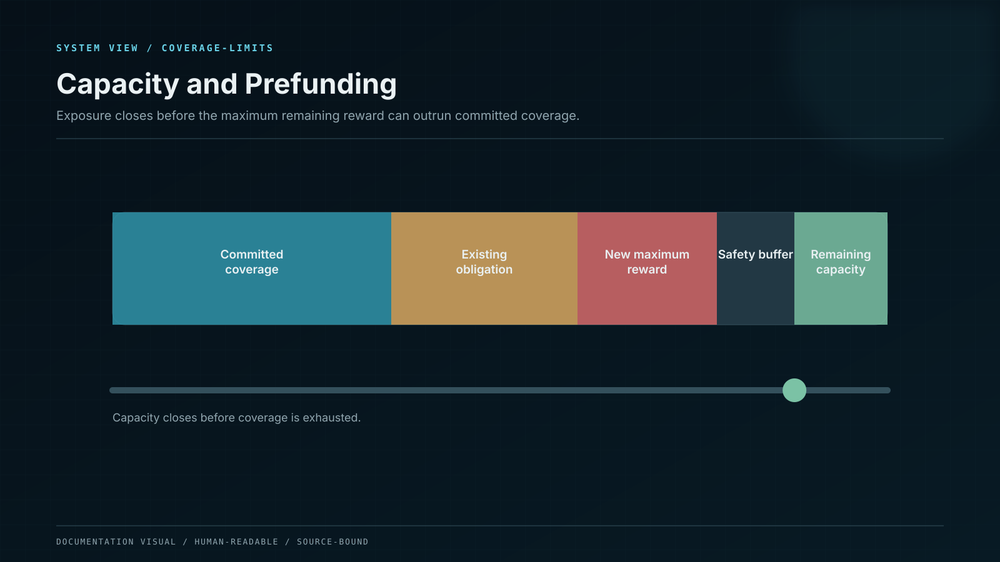

# Rates, Capacity, and Prefunding

A displayed rate becomes available for a new position only after the product proves that it has sufficient approved capacity and reward funding for the obligation it is about to accept.

## Current USDT and USDC catalogue

| Plan       |              Term | Monthly reward rate |                  Exact term reward rate |
| ---------- | ----------------: | ------------------: | --------------------------------------: |
| Flexible   | No fixed maturity |                6.0% | Accrues over fixed 30-day reward months |
| Locked 30  |           30 days |                9.2% |                                    9.2% |
| Locked 90  |           90 days |               12.3% |                                   36.9% |
| Locked 180 |          180 days |               14.7% |                                   88.2% |
| Locked 365 |          365 days |               16.8% |                                  201.6% |

The monthly percentages are not APR or APY. Locked obligations use the exact term reward rate stored in the accepted product version. Flexible accrual uses eligible seconds divided by the fixed 2,592,000-second reward month.

## Prefunding gate for Locked products

Before a fixed-rate position is accepted:

\[ EFC\_c \geq MRC\_c + OCB\_c ]

where:

* **EFC** is eligible forward coverage for cohort (c): controlled reward escrow, realised-yield reserve, approved coverage capital, and legally enforceable receivables after haircut;
* **MRC** is the maximum remaining contractual reward commitment of the cohort;
* **OCB** is the operating, settlement, liquidity, and stress-cost buffer.

Uncommitted strategy forecasts, projected deposits, marketing allocation, and customer principal do not count as eligible reward coverage.

## Capacity is the smallest safe limit

\[ \text{Capacity} = \min( \text{Funding}, \text{Strategy}, \text{Liquidity}, \text{Counterparty}, \text{Custody}, \text{Network}, \text{Operations}, \text{Legal} ) ]

Each accepted position atomically consumes the applicable capacity. Maturity, verified cancellation, or newly approved funding can release capacity. Concurrent requests cannot reserve the same coverage twice.

The review screen shows when a product is open, limited, waitlisted, or closed to new exposure. Existing Locked positions retain their accepted product version even when new capacity closes.

## Flexible-rate coverage

Flexible reward liability is measured continuously under the current and stressed rate schedules. A rate reduction can apply only prospectively after the configured notice and effective time. The platform cannot repair a funding gap by reversing posted reward or silently changing past accrual.

## Governance

* Rate proposal, treasury funding, risk approval, and publication are separate authorities.
* A rate increase cannot activate before funding, liquidity, and stress reservations pass.
* Product capacity, accepted principal, reward liability, eligible coverage, and buffer are reconciled at least daily and at every material event.
* A coverage breach blocks new exposure, escalates the incident, and preserves user-visible states.
* Auto-Reinvest is treated as a new capacity-consuming instruction, not silent compounding.

The current signed rate records are published through the [Product Version Register](../evidence-center/product-version-register.md), while reserve and liability evidence appears in [Reserves and Liabilities](../evidence-center/reserves-and-liabilities.md).
