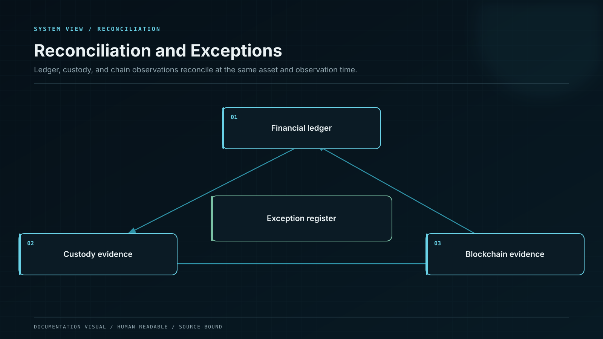
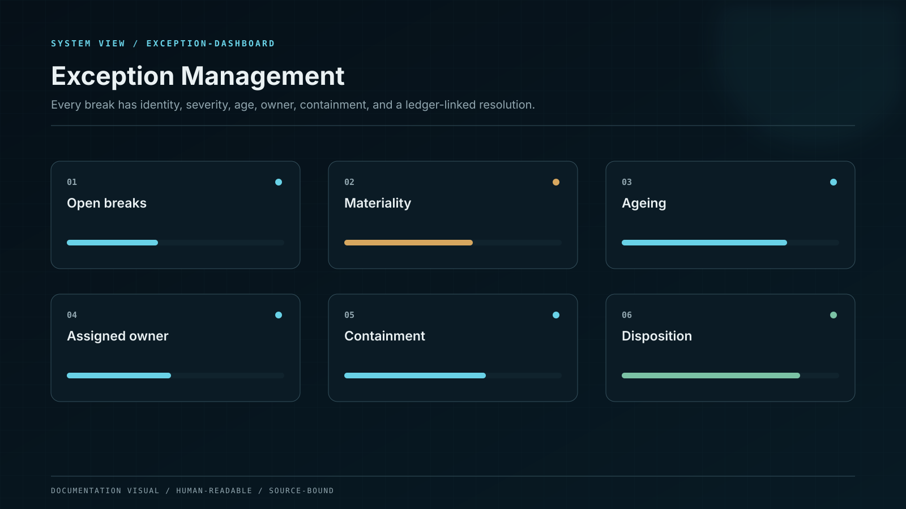

# Reconciliation and Exception Management

Reconciliation proves that internal obligations are supported by external assets and expected movements. It compares ledger control accounts with chain and custody evidence, explains timing differences, assigns exceptions and blocks only the affected capability when material uncertainty remains.

## Control model

| Component or state | Responsibility                                                  |
| ------------------ | --------------------------------------------------------------- |
| Ledger snapshot    | Immutable cut of balances and in-flight accounts.               |
| External evidence  | Direct chain balances, contracts and custody positions.         |
| Normalisation      | Asset identity, precision, finality and pending classification. |
| Comparison         | Expected versus observed balances and movements.                |
| Exception queue    | Reason, materiality, owner, SLA and evidence.                   |
| Resolution         | Replay, correction, provider escalation or controlled freeze.   |

## Invariants

* Reconcile per legal entity, chain, asset, custody location and balance state.
* Use exact base units but define materiality and timing tolerances by asset and lifecycle.
* Preserve independent external evidence; a provider webhook alone is insufficient.
* Every exception has a stable identity, ageing, owner and disposition.
* Corrections post through the ledger and reference the resolved exception.

## Failure containment

| Failure           | Effect                               | Control                  | Response     |
| ----------------- | ------------------------------------ | ------------------------ | ------------ |
| Timing difference | False incident blocks operations     | Finality/pending buckets | AGE          |
| Real shortfall    | Liabilities exceed controlled assets | Materiality breaker      | FREEZE SCOPE |
| Bad normalisation | Equivalent units compare incorrectly | Canonical asset model    | REPROCESS    |
| Silent exception  | Mismatch persists without owner      | Exception SLA/escalation | ESCALATE     |

## Operational evidence

* Sixty-second reconciliation daemon and scoped safe-mode implementation.
* Reconciliation specification and control-account mapping.
* Asset-specific tolerances, finality windows and materiality policy.
* Synthetic shortage, excess, stale-provider and reorg exercises.
* Exception ageing, resolution and governance report.

## Boundary conditions

Exact conservation, timing tolerance, and operational materiality are evaluated independently; no single threshold substitutes for the other controls.
