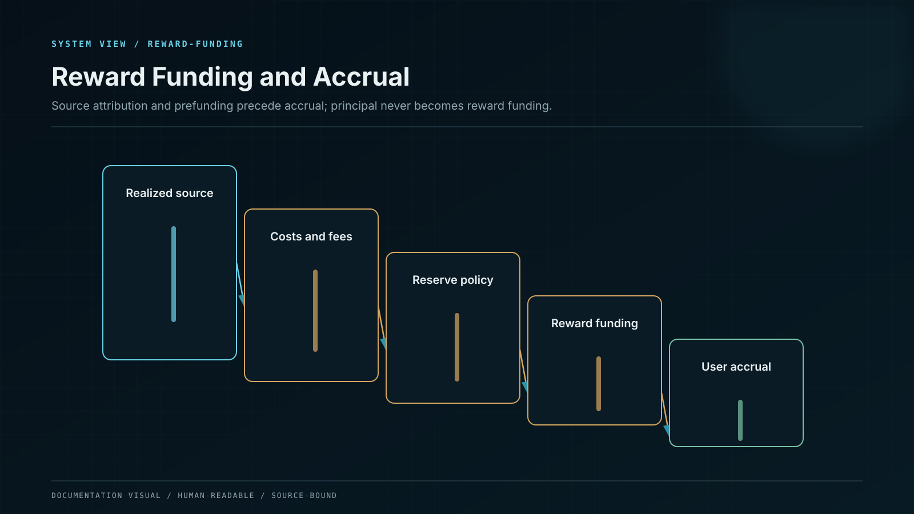
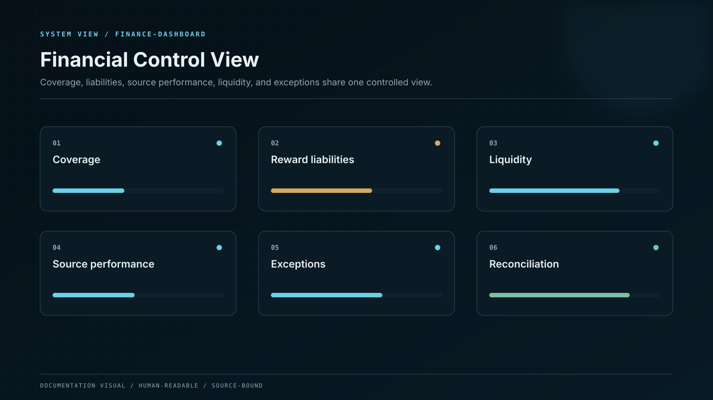

# Reward Funding, Yield, and Accrual

The user-facing rate, the accrued reward liability and the economic source that funds it are separate controlled objects. Current plans use monthly reward rates with daily accrual; every amount is reproducible from a signed product version, attributed to an approved source category, and reconciled without treating user principal as income.

## Control model

| Component or state   | Responsibility                                                                |
| -------------------- | ----------------------------------------------------------------------------- |
| Plan position        | Asset, eligible principal, Flexible or Locked term and accepted rate version. |
| Accrual engine       | Deterministic daily calculation from an explicitly monthly reward rate.       |
| Source attribution   | Network, protocol, strategy or separately approved subsidy bucket.            |
| Funding control      | Recognised source assets and budgets compared with user reward liability.     |
| Financial ledger     | Accrued, payable, settled, reversed and disputed reward states.               |
| Statement + evidence | User-visible amount linked to formula, source class and settlement state.     |

## Invariants

* Monthly reward rate is never relabelled APR or APY; Locked positions retain the accepted rate version and Flexible changes are prospective and notice-controlled.
* Accrual, funding and payment remain distinct: every credit links to a source category, and customer principal or later subscriptions are never classified as reward income.
* Protocol/network income, strategy result and treasury, operational-reserve or marketing subsidy use separate accounts, evidence and disclosure.
* Every active product version fixes day count, timezone, partial-day treatment, compounding, precision, rounding, credit cadence, maturity, and reversal behavior.
* XP, chests, referral points and other progression remain outside the financial reward ledger unless a separate legal entitlement is created.

## Failure containment

| Failure             | Effect                                          | Control                                         | Response            |
| ------------------- | ----------------------------------------------- | ----------------------------------------------- | ------------------- |
| Funding shortfall   | Accrued reward exceeds approved source coverage | Cohort coverage ratio and exposure cap          | STOP NEW EXPOSURE   |
| Rate ambiguity      | Systems or users calculate different amounts    | Signed formula and golden cases                 | REJECT RATE VERSION |
| Source mislabelling | Subsidy appears as protocol-derived yield       | Source-specific ledger and disclosure           | CORRECT + REVIEW    |
| Retroactive change  | Accepted entitlement changes silently           | Immutable rate binding and compensating journal | REJECT              |

## Operational evidence

* The registry contains fifteen canonical assets; USDT and USDC expose the published monthly-rate matrix, USD 50 minimum, Flexible plan, and 30/90/180/365-day Locked plans with daily accrual.
* Exact day-count, timestamp, compounding, rounding, crediting and maturity specification for every product version.
* Reward-source register and gross-to-user waterfall for each active asset, plan, cohort and rate version.
* Daily user-liability coverage, subsidy budget/runway and proof that customer principal is excluded from reward-source calculations.

## Boundary conditions

Reward-source attribution and fee policy are bound independently to each product version. No universal source mix or performance fee is inferred across products.
