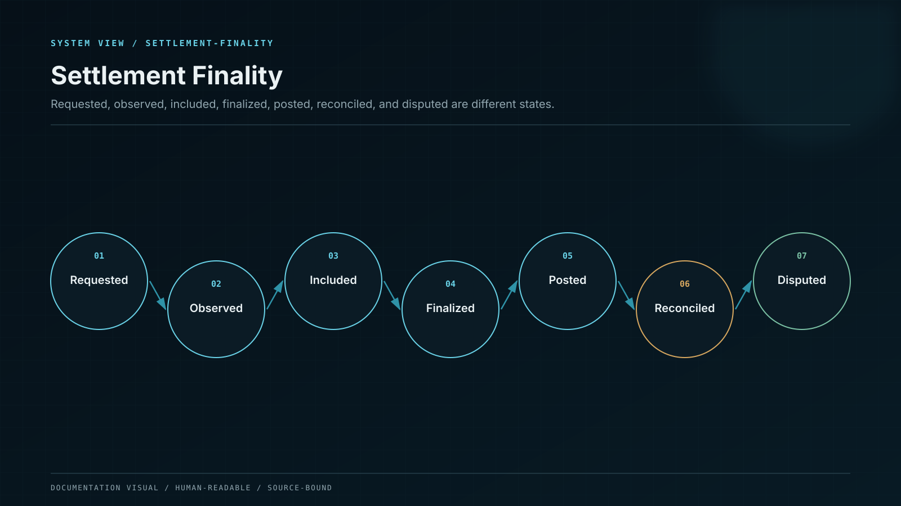

# Settlement Finality and Financial Exceptions

Settlement is a state machine, not a boolean. Whale CeFi distinguishes requested, observed, included, finalised, custody-confirmed, ledger-posted, reconciled, failed, replaced, reversed and disputed states across networks and products.

## Control model

| Component or state | Responsibility                                   |
| ------------------ | ------------------------------------------------ |
| Requested          | A valid business instruction exists.             |
| Observed           | External network/provider has emitted evidence.  |
| Included           | Transaction is in a canonical candidate block.   |
| Finalised          | Network policy accepts reorg probability.        |
| Posted             | Balanced internal journal reflects the event.    |
| Reconciled         | Independent asset and liability evidence agrees. |

## Invariants

* Define terminal and recoverable states for every transaction type.
* L2 finality policy models sequencer inclusion and L1 settlement separately.
* Custody-provider status cannot silently override contradictory on-chain evidence.
* State transitions are monotonic unless an explicit reversal path is invoked.
* Customer-visible labels map exactly to operational and ledger states.

## Failure containment

| Failure            | Effect                                     | Control              | Response             |
| ------------------ | ------------------------------------------ | -------------------- | -------------------- |
| Premature finality | Spendable balance precedes safe settlement | Chain policy         | HOLD                 |
| Provider conflict  | Custody and chain disagree                 | Exception state      | INVESTIGATE          |
| Invalid transition | Lifecycle skips required control           | State-machine guard  | REJECT               |
| UI mislabel        | User believes pending is complete          | Canonical projection | Reject and reconcile |

## Operational evidence

* Settlement state machines by chain and product.
* L1/L2 finality and sequencer-dependency matrix.
* Provider/on-chain conflict test suite.
* UI-to-ledger state mapping and localisation review.
* Exception and reversal authority matrix.

## Boundary conditions

No single confirmation count is declared safe for every supported network, asset and action.
