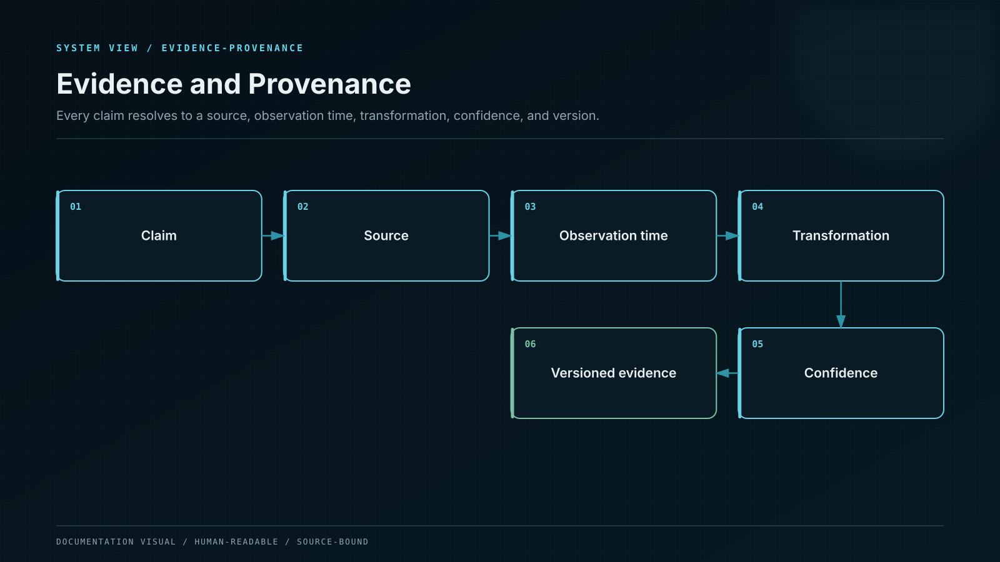

# Source Attribution

Yield is disclosed by source, not hidden inside one blended percentage.

| Source class               | Economic origin                            | Recognition gate                                                        | Principal risks                                  |
| -------------------------- | ------------------------------------------ | ----------------------------------------------------------------------- | ------------------------------------------------ |
| Native validation          | Protocol issuance and transaction fees     | Reward finalized, attributable, and net of validator costs and slashing | Slashing, lockup, validator, network             |
| Overcollateralized lending | Borrower interest                          | Interest settled or contractually receivable under an approved haircut  | Liquidation, oracle, smart contract, liquidity   |
| Protocol liquidity fees    | Trading or protocol usage fees             | Fees realized and withdrawable under the valuation policy               | Impermanent loss, depeg, contract, concentration |
| Market-neutral spread      | Basis, funding, or matched spread          | Both legs reconciled; hedge and closeout costs recognized               | Basis break, exchange, margin, execution         |
| Contractual economics      | Rebate or revenue share                    | Counterparty statement and cash or asset settlement                     | Counterparty, dispute, concentration             |
| Incentive escrow           | Pre-committed platform or campaign capital | Funds controlled, ring-fenced, and capacity-reserved                    | Budget exhaustion, governance                    |
| Coverage capital           | Platform-owned buffer                      | Release approved under the shortfall policy                             | Capital depletion                                |

## The source record

Every approved source has a versioned record containing:

* legal counterparty or protocol identity;
* asset, network, contracts, accounts, and custody route;
* the exact income-recognition event;
* gross and net measurement method;
* fees, slippage, hedge cost, taxes, and loss treatment;
* liquidity, lockup, withdrawal, and settlement horizon;
* exposure cap and concentration group;
* valuation source, haircut, and stale-data rule;
* operational owner and independent risk owner;
* incident triggers, unwind route, and evidence references.

## Recognition rules

* Protocol emissions are measured in their native asset. A volatile reward token does not become stable-value income before the approved realization event.
* Rebasing, fee-on-transfer, callback-enabled, or other non-standard assets require an explicit adapter and adversarial test profile.
* Borrower interest cannot be recognized once as an accrual and again as a settlement.
* A disputed, encumbered, or illiquid receivable receives a zero or risk-adjusted value under policy.
* A source failure remains visible. Treasury support cannot be relabeled as protocol yield.

## Prohibited sources

Incoming customer principal, circular borrowing, self-issued unliquidated tokens, uncommitted fundraising, referral deposits, and accounting reclassifications are never valid yield sources.
