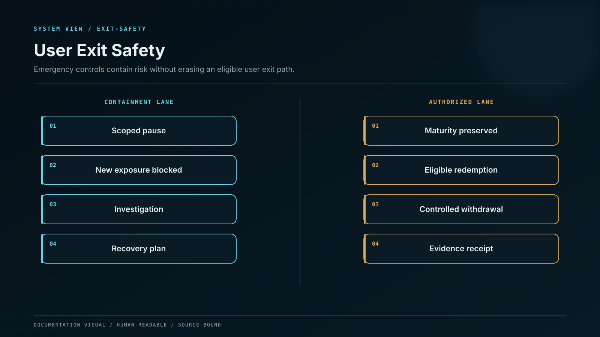

# Withdrawal and User Exit Safety

Withdrawals reverse the deposit path under stricter authority. The platform authenticates intent, reserves the liability, screens policy, obtains custody approval, broadcasts the exact authorised transfer, observes finality, and settles the ledger without trapping legitimate user exits during an incident.

## Control model

| Component or state | Responsibility                                                        |
| ------------------ | --------------------------------------------------------------------- |
| Request            | Authenticated user selects asset, network, amount and destination.    |
| Risk checks        | Balance, destination, sanctions, velocity and product-state controls. |
| Reservation        | Available liability moves atomically to withdrawal-pending.           |
| Custody approval   | MPC custody policy authorises the exact transfer request.             |
| Broadcast/finality | Chain transaction is observed to terminal state.                      |
| Settlement         | Ledger clears reserved liability, fee and custody asset movement.     |

## Invariants

* Bind approval to immutable asset, chain, destination, amount, fee limit and expiry.
* Use separate idempotency identities for request, custody job and chain transaction.
* Never debit available balance without a recoverable reserved state.
* Failed, replaced and expired transactions follow explicit ledger transitions.
* Emergency pause design preserves a governed path for safe user exits where technically possible.

## Failure containment

| Failure              | Effect                              | Control                         | Response |
| -------------------- | ----------------------------------- | ------------------------------- | -------- |
| Address substitution | Funds leave to attacker destination | Decoded approval binding        | BLOCK    |
| Double withdrawal    | Same liability is spent twice       | Atomic reservation/idempotency  | REJECT   |
| Stuck transaction    | Funds remain indefinitely reserved  | Replacement/expiry workflow     | RESOLVE  |
| Global pause         | Users cannot exit safe assets       | Granular breaker/emergency exit | LIMIT    |

## Operational evidence

* Withdrawal state machine, posting rules and approval contract.
* Destination, velocity, sanctions and step-up-authentication tests.
* Failed, replaced, dropped and reorg transaction scenarios.
* MPC custody policy-to-ledger correlation evidence.
* Emergency withdrawal and user-communication exercise.

## Boundary conditions

Emergency control is operation-, asset-, and network-scoped; a risk-increasing path can stop without erasing a valid principal claim or its governed safe-exit route.
