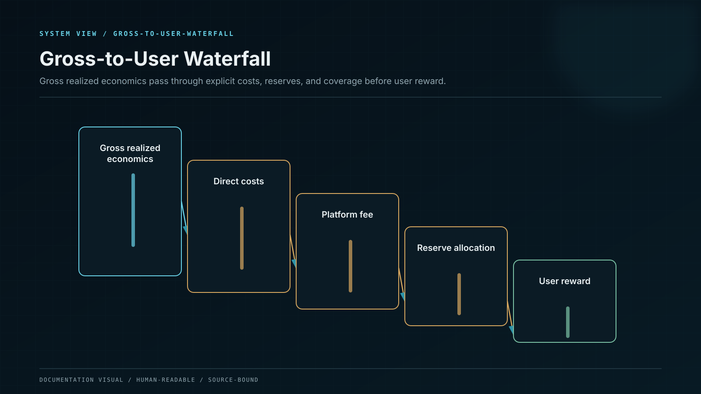
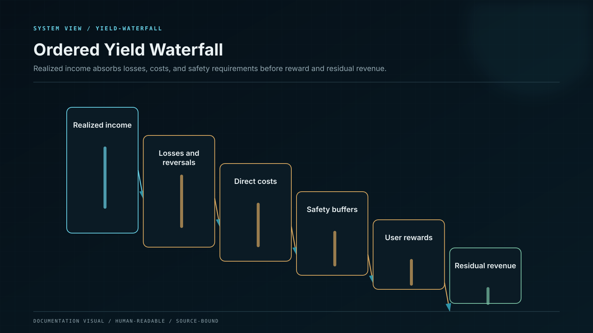

# Yield Waterfall

The waterfall converts realized external economics into distributable reward without crossing the principal boundary.

## Epoch calculation

For source (s) and accounting epoch (t):

$$Y^{net}_{s,t}=\max\left(0, G_{s,t}-L_{s,t}-C_{s,t}-H_{s,t}-B_{s,t}\right)$$

Where:

* (G) — gross realized external income;
* (L) — realized strategy loss, slashing, reversal, or impairment;
* (C) — protocol, validator, custody, execution, and settlement costs;
* (H) — hedge, closeout, and resolution costs;
* (B) — mandatory contribution required to restore risk and liquidity buffers.

The product policy splits net external yield into user allocation (Y^u), retained reserve (Y^r), and residual platform share (Y^p):

$$Y^{net}=Y^u+Y^r+Y^p$$

Funding available for cohort (c) is:

$$F_{c,t}=Y^u_{c,t}+S_{c,t}+K_{c,t}$$

Where (S) is a released amount from the cohort's pre-funded incentive escrow and (K) is approved coverage-capital support. Neither becomes platform revenue.

The payable amount and funding gap are:

$$U_{c,t}=\min(D_{c,t},F_{c,t})$$

$$\Delta_{c,t}=\max(0,D_{c,t}-F_{c,t})$$

Where (D) is the reward liability due under the product version. A non-zero (\Delta) invokes the shortfall policy and closes new exposure for the affected cohort.

## Ordered waterfall

## Revenue recognition

Platform revenue is recognized only after the epoch closes, external income settles, losses and direct costs are posted, required buffers are restored, user obligations are covered, and reconciliation passes. A projected margin is not revenue.
